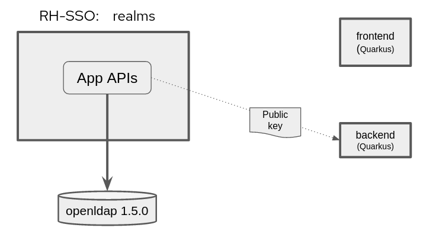

:scrollbar:
:data-uri:
:toc2:
:linkattrs:

= RH-SSO / LDAP Quickstart

The purpose of this quickstart is to demonstrate OpenID Connect (OIDC) based security where the system of record of user and role data is in an LDAP server.

In addition, this quickstart can further be used to investigate details of the JSON Web Token (JWT) based _access token_ required by the API Gateway of 3scale.

=== Demo Highlights

. _User Federation_ capabilities of RH-SSO.
+
In particular, the _WRITABLE_ strategy is used to replicate any change that's made to federated users back to the LDAP directory.

. _org.eclipse.microprofile.rest.client.propagateHeaders_ system property
+
Quarkus provides a convenient approach to specify request headers that should be propogated to downstream RESTful services via the REST client. 

. The _aud_ claim of an _access token_ is required by the _apicast_ gateway of 3scale.

:numbered:

== Demo Architecture

This quickstart includes both _docker-compose_ (for a local deployment) as well as ansible (for deployment to OpenShift).
In both cases, the following containers are deployed (as per the above diagram) : 

.. *openldap*
+
System of record of user and role data.

.. *RH-SSO*
+
Provisioned with a realm enabled with _User Federation_ to openldap.

.. *Frontend* service
+
Quarkus based app that exposes REST API and invokes _backend_ service (with _Authorization_ header propogated to _backend_ service).

.. *Backend* service
+
Quarkus based app that exposes REST API secured using RBAC.
The service is enabled with a _keycloak adapter_.
At start-up, this _keycloak adapter_ acquires the SSO public key.
When a request is sent to this service, the _access token_ in the request is validated using this SSO public key. 

Once provisioned, you'll use the _curl_ utility to smoke test as per the following: 

image::docs/images/quickstart_data_flow.png[]

== Local Environment
This quickstart includes a _docker-compose_ to facilitate development and testing in your local environment.

=== Pre-reqs

. _docker_ or _podman_

. _docker-compose_

. _curl_ utility

. _ldapsearch_

=== Environment Variables

. Set the following environment variables with values similar to the following:
+
-----
RHSSO_HOST=localhost
RHSSO_URL=http://$RHSSO_HOST:4080
REALM_ID=ldap-demo
SSO_CLIENT_ID=ldap-app
SSO_CLIENT_CREDENTIALS=4a0e88a7-e3fc-4b88-b5a4-7f77fc38e52a
retrieve_token_url="$RHSSO_URL/realms/$REALM_ID/protocol/openid-connect/token"
BACKEND_ROUTE=http://localhost:8080
FRONTEND_ROUTE=http://localhost:7080
-----

=== Startup

. Start application pod with all linux containers:
+
-----
$ docker-compose -f etc/docker-compose.yaml up -d
-----

=== Smoke Test

. View all users and roles in openldap:
+
-----
$ ldapsearch -x -h localhost -p 3389 -b dc=example,dc=org -D "cn=admin,dc=example,dc=org" -w admin
-----

. View details of OIDC related REST API as exposed by RH-SSO:
+
-----
$ curl -v -X GET "$RHSSO_URL/realms/$REALM_ID/.well-known/openid-configuration" | jq .
-----

. Retrieve an OAuth2 token using the Zync-queue created SSO client (in the API GW related SSO Realm) corresponding to the API application Id :
+
-----
TKN=$(curl -X POST "$retrieve_token_url" \
            -H "Content-Type: application/x-www-form-urlencoded" \
            -d "username=jbrown" \
            -d "password=password" \
            -d "grant_type=password" \
            -d "client_id=$SSO_CLIENT_ID" \
            -d "client_secret=$SSO_CLIENT_CREDENTIALS" \
            | sed 's/.*access_token":"//g' | sed 's/".*//g')

$ echo $TKN
-----

. By setting _fullScopeAllowed=true_ in SSO client, all roles assocated with an authenticated user will be included in the access token.
+
These roles can be visualized as follows:
+
-----
$ jq -R 'split(".") | .[1] | @base64d | fromjson' <<< $TKN | jq .realm_access.roles

[
  "ldap-user",
  "ldap-admin"
]
-----

. Invoke backend-oidc service directly:
+
-----
$ curl -v -H "Authorization: Bearer $TKN" \
       -H "Accept: text/plain" \
       -X GET $BACKEND_ROUTE/backend/secured
-----

. Invoke frontend service (which subsequently invokes the downstream _backend-oidc_ service with _propogated_ request headers): 
+
-----
$ curl -v -H "Authorization: Bearer $TKN" \
       -X GET $FRONTEND_ROUTE/frontend

< HTTP/1.1 200 OK
Hello jbrown with roles: ldap-user ldap-admin
-----

=== Test _WRITEABLE_ strategy
The User Federation configs found in the demo specify a _WRITABLE_ strategy for synchronizing federated user data between RH-SSO and LDAP.  Details regarding the various synchronization strategies supported in RH-SSO can be found in the section _Integrating with LDAP and Active Directory_ of link:https://smile.amazon.com/Keycloak-Management-Applications-protocols-applications/dp/1800562497[Keycloak - Identity & Access Management for Modern Apps] book.

. In the _ldap-demo_ realm, add a new realm role called:  _new_role_ 
+
Roles -> Add Role -> Role Name -> _new_role_

. Assocate the _new_role_ role with the _jbrown_ user:
+
Users -> _jbrown_ -> Role Mappings -> Assigned Roles -> _new_role_
+
image::docs/images/new_role_added.png[]

. Execute the following to verify that the new role was synced to the remote ldap: 
+
-----
$ ldapsearch -x \
             -h localhost \
             -p 3389 \
             -b cn=new_role,ou=RealmRoles,dc=example,dc=org \
             -D "cn=admin,dc=example,dc=org" \
             -w admin
-----

. The response should include the following:app-name:
+
-----

...

# new_role, RealmRoles, example.org
dn: cn=new_role,ou=RealmRoles,dc=example,dc=org
objectClass: groupOfNames
cn: new_role
member: cn=empty-membership-placeholder
member: uid=jbrown,ou=People,dc=example,dc=org

...

-----

== OpenShift
This quickstart includes _ansible_ to deploy to an OpenShift environment.

=== Pre-reqs:
. _OpenShift_ cluster ( >= v 4.6 )
+
The cluster should have about 4 GBs and 2 CPUs to allocate to the resources of this quickstart.

. _oc utiltiy_

. _curl_ utility

. _ldapsearch_

=== Startup

. Change directory into the _ansible_ directory of this project: 
+
-----
$ cd ansible
-----

. Execute _ansible_playbook_
+
-----
$ ansible-playbook playbooks/install.yml
-----

. The playbook provisions the following in OpenShift:

.. *rhi_idm* namespace:
... *openldap*
... *RH-SSO*

.. *user1-services* namespace: 
... *frontend* service
... *backend* service

=== Environment Variables

. Set the following environment variables with values similar to the following:
+
-----
OCP_DOMAIN=apps$(oc whoami --show-console | awk 'BEGIN{FS="apps"}{print $2}')
RHSSO_HOST=sso-rhi-idm.$OCP_DOMAIN
RHSSO_URL=https://$RHSSO_HOST
RHSSO_MASTER_PASSWD=$(oc get secret credential-rhsso -o json -n rhi-idm | jq -r .data.ADMIN_PASSWORD | base64 -d)
REALM_ID=user1-ldap
SSO_CLIENT_ID=ldap-app      # preset in realm deployed by project ansible
SSO_CLIENT_CREDENTIALS=password     # preset in realm deployed by project ansible
retrieve_token_url="$RHSSO_URL/auth/realms/$REALM_ID/protocol/openid-connect/token"
FRONTEND_ROUTE=https://frontend-user1-services.$OCP_DOMAIN
-----

=== Smoke Test
. Retrieve an OAuth2 token using the Zync-queue created SSO client (in the API GW related SSO Realm) corresponding to the API application Id :
+
-----
TKN=$(curl -X POST "$retrieve_token_url" \
            -H "Content-Type: application/x-www-form-urlencoded" \
            -d "username=jbrown" \
            -d "password=password" \
            -d "grant_type=password" \
            -d "client_id=$SSO_CLIENT_ID" \
            -d "client_secret=$SSO_CLIENT_CREDENTIALS" \
            | sed 's/.*access_token":"//g' | sed 's/".*//g')

$ echo $TKN
-----

. By setting _fullScopeAllowed=true_ in SSO client, all roles assocated with an authenticated user will be included in the access token.
+
These roles can be visualized as follows:
+
-----
$ jq -R 'split(".") | .[1] | @base64d | fromjson' <<< $TKN | jq .realm_access.roles

[
  "ldap-user",
  "ldap-admin"
]
-----

. Invoke frontend service: 
+
-----
$ curl -v -H "Authorization: Bearer $TKN" \
       -X GET $FRONTEND_ROUTE/frontend

< HTTP/1.1 200 OK
Hello jbrown with roles: ldap-user ldap-admin
-----

== API Gateway security using LDAP backed OIDC
This quickstart can further be used to investigate details of the JSON Web Token (JWT) based _access token_ required by the API Gateway of 3scale.

=== Pre-reqs:

. _3scale API Manager and Tenant_ (version 2.11)
+
Your OpenShift cluster should have the 3scale API _Manager_ and _Tenant_ installed (preferrably via the 3scale Operator).

. _3scale APIcast Gateway_ (version 2.11)

.. An apicast gateway should be provioned via the OpenShift operator in the _user1-services_ namespace

=== Additional Environment Variables

-----
API_SSO_CLIENT_ID=0171daa2                                              # auto-generated in RH-SSO by zync
API_SSO_CLIENT_CRED=ec37f4b50fc6d78fa43b61111029b99d                    # auto-generated in RH-SSO by zync
API_GW_URL=https://apicast-gw-user1-services.$OCP_DOMAIN
-----

=== Smoke Test API Gateway
. Retrieve an OAuth2 token using the Zync-queue created SSO client (in the API GW related SSO Realm) corresponding to the API application Id :
+
-----
TKN=$(curl -X POST "$retrieve_token_url" \
            -H "Content-Type: application/x-www-form-urlencoded" \
            -d "username=jbrown" \
            -d "password=password" \
            -d "grant_type=password" \
            -d "client_id=$API_SSO_CLIENT_ID" \
            -d "client_secret=$API_SSO_CLIENT_CRED" \
            | sed 's/.*access_token":"//g' | sed 's/".*//g')

$ echo $TKN
-----

. Invoke frontend service: 
+
-----
$ curl -v -H "Authorization: Bearer $TKN" \
       -X GET $API_GW_URL/frontend

< HTTP/1.1 200 OK
Hello jbrown with roles: ldap-user ldap-admin
-----

=== JWT claims used by 3scale API GW

API GW extracts the value of the _azp_ or _aud_ claim of the access token and uses it as the Client ID that identifies the application in 3scale to authorize the call through the 3scale _Service Management API_. 

In practice, the _azp_ claim contains the SSO clientId that issued the access token.
That should be sufficient.
Unfortunately, as per link:https://issues.redhat.com/browse/THREESCALE-7006[THREESCALE-7006], the gateway also requires the _aud_ claim to be populated (the contents of which do not need to be accurate).

Otherwise, the following is an example failure in _apicast_ (when apicast logLevel: debug): 

-----
2021/12/27 23:42:23 [debug] 28#28: *13 oidc.lua:191: verify(): [jwt] failed verification for token, reason: 'aud' claim is required., requestID=f9e14f4fb6019ad77b5b162fe6def0f3
2021/12/27 23:42:23 [debug] 28#28: *13 proxy.lua:287: rewrite(): oauth failed with 'aud' claim is required., requestID=f9e14f4fb6019ad77b5b162fe6def0f3
-----

==== Determine value of _aud_ field in access token:

. Execute:
+
-----
$ jq -R 'split(".") | .[1] | @base64d | fromjson' <<< $TKN | jq .aud

[
  "realm-management",
  "broker",
  "account"
]
-----

. If the above returns _null_ then proceed to the next section to manually populate the _aud_ field of the access token:

==== Manual Fix

The sso realm configuration of this demo should by default generate access tokens whose _aud_ claim is populated.  So all is good.  
If not, then execute the following:

. Navigate to: `Users -> View all users -> <link to user> -> Role Mappings -> Client Roles`
. From the drop-down, select and add all _Available Roles_ from the following SSO clients:

.. _account_
.. _broker_
.. _realm-management_

Please refer to chapter 5 of link:https://smile.amazon.com/Keycloak-Management-Applications-protocols-applications/dp/1800562497[Keycloak - Identity & Access Management for Modern Apps] for more details and background regarding the _audience_ claim of a Keycloak generated _access token_.

==== Reference:

. link:https://datatracker.ietf.org/doc/html/rfc7519.html#section-4.1.3[Audience Claim as described in JWT specification]
. link:https://www.keycloak.org/docs/latest/server_admin/#audience-support[keycloak - Audience Support]
. link:https://www.pingidentity.com/en/company/blog/posts/2019/oauth2-access-token-multiple-resources-usage-strategies.html[Ping Identity: OAuth2 Token Usage Strategies for Multiple Resources]
. link:https://chat.google.com/room/AAAAdbt0MpQ/bO6zL3tUBcs[chat]
. link:https://access.redhat.com/documentation/en-us/red_hat_3scale_api_management/2.11/html/administering_the_api_gateway/openid-connect#apicast-oidc-integration[3scale API GW: JWT verification & parsing]
. link:https://issues.redhat.com/browse/THREESCALE-7006[THREESCALE-7006: "aud" claim is required in APIcast JWT validation]
. link:https://issues.redhat.com/browse/THREESCALE-3952[THREESCALE-3952: Claims verification in APIcast]

== External IDP Integration

=== github OAuth App

Create a new OAuth client in github

. Authenticate into github and navigate to:  `Settings -> Developer settings`.
. Click the `New OAuth App` button.
. Populate the form with the following values:app-name:
.. *Application name* : `external-idp-test`
.. *Homepage URL*: `https://github.com/redhat-na-ssa/keycloak_ldap_quickstart`
.. *Authorization callback URL*:  `http://localhost:8000`
. Click `Register application`
. In the details page of the new github OAuth App, copy both the `Client ID` as well as the `client secret`
+
image::docs/images/external-idp-settings.png[]

=== RH-SSO: github Identity Provider

. Modify both the `Client Id` as well as the `Client Secret` with the values provided in the github OAuth App
+
image::docs/images/rhsso_github_idp.png[]

. Click `Save`

== Reference

. link:https://docs.google.com/presentation/d/1PQu6XKFLgEy6O5Tm_OeiFfY88PVHX7hHAypHZJRP8ew/edit#slide=id.g775d9c5cf4_0_717[slidedeck]

. https://github.com/keycloak/keycloak/tree/main/examples/ldap

. link:https://access.redhat.com/documentation/en-us/red_hat_3scale_api_management/2.10/html/operating_3scale/provision-threescale-services-via-operator[3scale Config & Provision of 3scale via Operator]

