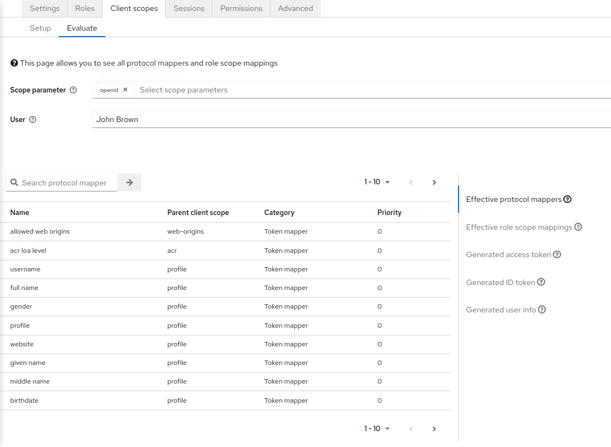
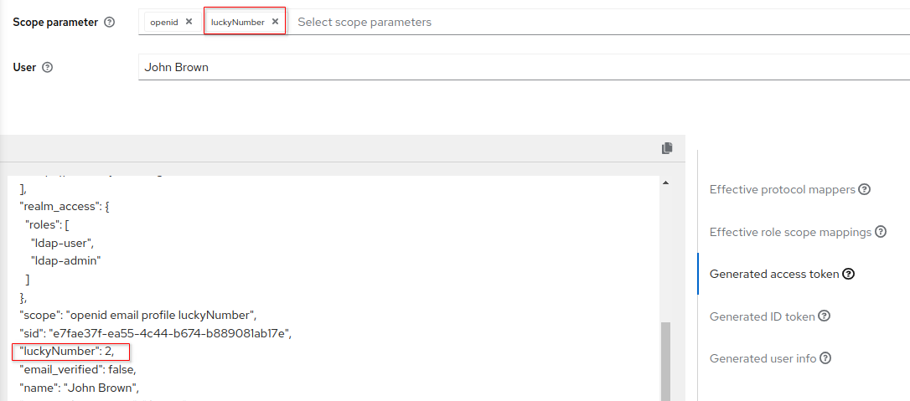
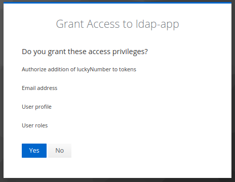
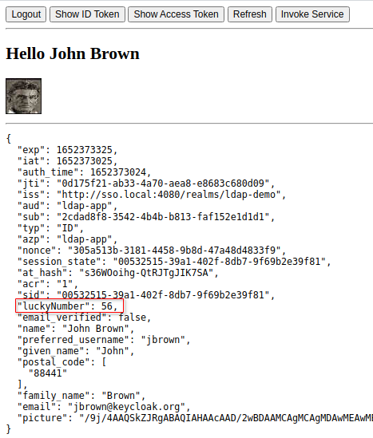

:scrollbar:
:data-uri:
:toc2:
:linkattrs:

= RH-SSO Extensions

:numbered:

== Custom Protocol Mapper

=== Protocol Mapper code
. Review the source code for the link:../lucky-number-mapper[Lucky Number Project] project.
+
Thank you link:https://www.n-k.de/[Niko Köbler] for this excellent link:https://github.com/dasniko/keycloak-tokenmapper-example[example]!

. Review the link:https://github.com/redhat-na-ssa/keycloak_customizations_quickstart/blob/main/etc/sso/Dockerfile[Dockerfile] for the RH-SSO container image.
+
Notice the inclusion of the compiled project jar file in the `/opt/keycloak/providers` directory:
+
-----
...

COPY etc/sso/providers/org.acme-lucky-number-mapper-0.0.1.jar /opt/keycloak/providers/org.acme-lucky-number-mapper-0.0.1.jar

...
-----

. Log in as a site admin to the _Master_ realm of RH-SSO.
. Navigate to the `Provider Info` tab and scroll down to the _protocol-mapper_ section.
. Notice the include of the _oidc-lucky-number-mapper_ entry:
+
image::images/lucky_number_provider_list.png[]

=== Create Client Scope

. In the console of your RH-SSO, navigate to: `kc-demo -> Client Scopes`
. Click `Create client scope`.
. Populate the form as follows: 
.. *Name*: luckyNumber
.. *Description*: Lucky Number generator
.. *Type*: Optional
+
An SSO client will need to explicity include this claim in the list of `scopes` in the token request.  If set to `Default`, this claim would not be required in the list of `scopes` in the token request.
+
NOTE:  The value of this field can be over-written when configuring `client scopes` for a specific SSO client.
.. *Protocol*: openid-connect
.. *Display On Consent Screen*:  ON
.. *Consent Screen Text*: Authorize addition of luckyNumber to tokens
.. *Include in Token Scope*:  ON
.. *Display Order*: 1
. 
Click Save.

. In the *Mappers* tab of the subsequent page, click `Configure a new mapper`
. Select `Lucky Number` and fill in the form to create a _luckyNumber_ protocol mapper
+
image::images/luckyNumber_mapper.png[]

. Click: `Save`

You have now created a client scope that can be re-used across all SSO clients.  
In addition, the user will now have the ability to consent to inclusion of a _luckyNumber_ claim in tokens consumed by downstream clients.  

This latter functionality is known as _OAuth2 scopes_.
You can find an excellent discussion of _OAuth2 scopes_ in chapter 8 of the book: link:https://smile.amazon.com/Keycloak-Management-Applications-protocols-applications-ebook-dp-B092KP135B/dp/B092KP135B/ref=mt_other?_encoding=UTF8&me=&qid=1652368580[Keycloak - Identity and Access Management for Modern Applications]

=== Add _Client Scope_ to SSO client

. Navigate to: `kc-demo -> Clients -> t-inspect -> Settings`
. In the _Settings_ tab, enable `Consent Required`.  Click `Save`.
. Switch to the _Client Scopes -> Setup_ tabs
. Click `Add client scope`, select `luckyNumber` and click `Add -> Optional`.
+
image::images/add_client_scope.png[]

. Notice that `luckyNumber` is now included in the list of `Client Scopes`.

=== Verify _luckyNumber_ claim

. Navigate to the `Clients -> t-inspect -> Client Scopes -> Evaluate`
. In the `User` text box, enter: `jbrown`
+

. Notice that in the `Effictive protocol mappers` view, there are about 27 mappers included, but none of them are `luckyNumber`.

. Switch to the `Generated access token` view and again notice the absence of a `luckyNumber` claim.

. From the `Scope parameter` drop down, select `luckyNumber`
+
Notice that a `luckyNumber` claim now appears on the token:
+

=== User Consent of new Claim

. In the SSO Admin Console, navitate to the `Settings` tab of the `t-inspect` SSO client.
. Turn on `Consent Required` and then`Save` your changes.
. In a new private browser tab, navigate to the `Token Inspector` webapp and login with the following credentials: 
.. *userId*:  jbrown
.. *Password*: password

. Notice you are prompted to grant access of various user attribute claims: 
+

.. What about the `luckyNumber` claim ?
.. In the browser tab with your RH-SSO admin console, navigate to: `Clients -> t-inspect -> Client Scopes`.
.. Notice the `Assigned type` on the `luckyNumber` client scope is set to `Optional`.  Switch this to `Default`.
.. In the `token-inspector` app, re-login as the `jbrown` user.  Do you now see `luckyNumber` as a claim to grant access to ?
. In the `token-inspect` app, click the `IDToken` tab and notice the inclusion of a _luckyNumber_: 
+

. In the browser tab of your RH-SSO admin console, navigate to the `consents` page of the `jbrown` user.
+
image::images/jbrown_consent.png[]

. Logout as the `jbrown` user in the `token inspector` app.  Re-login and notice that you are not prompted to consent to granting access to claims.  Why ?
+
In the RH-SSO Admin Console, revoke the existing consent and re-log into the `token inspector` app.  Notice that you are now prompted to once again grant access to various consents. 

== OIDC Logout

When `picture` claim is included in ID Token, the logout flow breaks.
The reason for this is because upon attempted logout, the redirect request from the browser includes a query parameter of `id_token_hint`.  The value of this field is the `id token`.  When the `picture` claim in included in the ID Token, the max size of the request header is exceeded and subsequently, the following error is returned: 

-----
414 Request-URI Too Long
-----

Not that this is a satisfactory fix, but to alleviate the problem by modifying the `type` on the `picture` client-scope for the `t-inspect` SSO client.  Observe the change in logout behavior.

== Custom Authenticator
This exercise is inspired by the following blog post: link:https://www.janua.fr/transient-sessions-in-keycloak/[Transient sessions in Keycloak].  Thank you!

=== Review `transient-authn` project

. Review the source code of the link:../transient-authn[transient-authn] project.
+
Answer the following questions: 

. Review the link:../etc/sso/Dockerfile[Dockerfile] used to create your RH-SSO container.
+
Notice the jar file that includes the compiled `transient-authn` classes is copied to the directory where keycloak scans for custom providers at build time : 
+
-----
COPY etc/sso/providers/org.acme-transient-authn-0.0.1.jar /opt/keycloak/providers/org.acme-transient-authn-0.0.1.jar
-----

. In the RH-SSO admin console, navigate to the `Provider Info` of the `master` realm:
+
Notice the presence of the `transient-authn` custom authenticator: 
+

=== Modify `Direct Grants` AuthN Flow

=== Test
. Navigate to the _jbrown_ user in the RH-SSO Admin Console.  Ensure there are zero active sessions.

. Acquire tokens via Direct Access Grant flow using the _boidc SSO client:
+
-----
curl -X POST "$OIDC_TOKEN_URL" \
            -H "Content-Type: application/x-www-form-urlencoded" \
            -d "username=jbrown" \
            -d "password=password" \
            -d "grant_type=password" \
            -d "client_id=boidc" \
            -d "client_secret=password" \
            -d "scope=openid"
-----

. In the RH-SSO Admin Console, return to the `sessions` tab of the _jbrown_ user.  Are there any sessions associated with that user ?

. Acquire tokens via Direct Access Grant flow using the _t-inspect_ SSO client:
+
-----
curl -X POST "$OIDC_TOKEN_URL" \
            -H "Content-Type: application/x-www-form-urlencoded" \
            -d "username=jbrown" \
            -d "password=password" \
            -d "grant_type=password" \
            -d "client_id=t-inspect" \
            -d "scope=openid"
-----

. In the RH-SSO Admin Console, return to the `sessions` tab of the _jbrown_ user.  Are there now any sessions associated with that user ?

