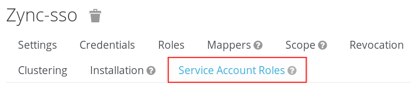

:scrollbar:
:data-uri:
:toc2:
:linkattrs:

= Dynamic Client Registration

:numbered:

== Quickstart Highlights

. Understand use case for Dynamic Client Registration
. Understand different implementation approaches for Dynamic Client Registration in RH-SSO

== Overview

=== Use Case

=== RH-SSO Providers
Red Hat SSO exposes a RESTful API that among other functions allows for the creation of SSO clients.
This API is called the _Client Registration Service_.

The RH-SSO Client Registration Service includes multiple implementations (aka: _providers_) as follows: 

[%header, cols=2*]
|===
|Provider Name
|Request Payload Format
|default|RH-SSO Client Representation (JSON)
|install|RH-SSO Adapter Configuration (JSON)
|openid-connect|OIDC Client Metadata Description (JSON)
|saml2-entity-descriptor| SAML Entity Descriptor (XML)
|===

The endpoint exposed by the Client Registration Service is as follows: 

-----
$RHSSO_URL/<realm_name>/clients-regisration/<provider name>
-----

=== Quickstart Overview
In this quickstart, a SSO client called _zync-sso_ will be configured with privildges to _manage-clients_ within the SSO realm.
Once created, this SSO client can facilitate the management of all other SSO clients within the realm.

== Create Initial Access Token

Creation of the _zync-sso_ client will occur by invoking the _default_ provider of RH-SSO's _client registration service_ API.

To invoke the _default_ provider of Red Hat SSO _client registration service_ API, you need to use an  _Initial Access Token_.
This _Initial Access Token_ can be retrieved as follows:

. Using _Resource Owner Password Credentials_ flow on the _admin-cli_ SSO client, acquire a OAuth2 Bearer Access Token: 
+
-----
ADMIN_API_TKN=$(curl -X POST "$ACCESS_TOKEN_URL" \
            -H "Content-Type: application/x-www-form-urlencoded" \
            -d "username=$REALM_ADMIN" \
            -d "password=$REALM_ADMIN_PASSWD" \
            -d "grant_type=password" \
            -d "client_id=admin-cli" \
            -d "scope=openid" \
            | sed 's/.*access_token":"//g' | sed 's/".*//g')

$ echo $ADMIN_API_TKN
-----

. Using the access token, invoke the _clients-initial-access_ API of RH-SSO to acquire an _initial access token_
+
-----
$ INITIAL_ACCESS_TOKEN=$(curl -X POST \
    -d "{\"expiration\": 432000, \"count\": 100}" \
    -H "Content-Type:application/json" \
    -H "Accept: application/json" \
    -H "Authorization: Bearer $ADMIN_API_TKN" \
    $RHSSO_URL/admin/realms/$REALM_ID/clients-initial-access \
    | jq -r '.token'
    )
-----

ifdef::showscript[]
. Log in to the Red Hat SSO console as a site admin.  

.. Recall that the URL to your SSO realm is the output of the following:
+
-----
$ echo -en "\n$RHSSO_URL/admin/$REALM_ID/console\n\n"
-----

.. Credentials are as follows: 
... *User name*:  $( echo $REALM_ADMIN )
... *Password*:  $( echo $RHSSO_ADMIN_PASSWD )

. Navigate to *Clients -> Initial Access Tokens*.
. Click *Create*.
. Set an *Expiration* of 5 days or more and a *Count* of 100 or more, then click *Save*.
* An Initial Access Token appears:
+
image::images/initial_access_token.png[]

. Copy the entire Initial Access Token and set it as a shell environment variable:
+
-----
export INITIAL_ACCESS_TOKEN=<generated access token from RH-SSO>
-----
endif::showscript[]

=== Create _zync-sso_ client
In this section, you will invoke the RH-SSO _/clients-registrations/default_ API using the _initial access token_ to create a new SSO client (called _zync-sso_ ).

This SSO client is configured with _manage-client_ privledges that subsequently allow it to create other SSO clients.

. Set the desired name of the new SSO client as an environment variable:
+
-----
$ export ZYNC_SSO_CLIENT_NAME=zync-sso
-----

. Study the following HTTP POST request and then execute it:
+
-----

$ curl -v -X POST \
    -d "{ \"clientId\": \"$ZYNC_SSO_CLIENT_NAME\", \"standardFlowEnabled\":\"false\", \"directAccessGrantsEnabled\":\"false\",  \"serviceAccountsEnabled\":\"true\", \"publicClient\":\"false\" }" \
    -H "Content-Type:application/json" \
    -H "Accept: application/json" \
    -H "Authorization: Bearer $INITIAL_ACCESS_TOKEN" \
    $RHSSO_URL/realms/$REALM_ID/clients-registrations/default \
    | jq -r . > /tmp/zync_sso_client_details.json

# Review the output
$ cat $API_RESPONSE_DIR/zync_sso_client_details.json | more
-----
+
Execution of this command creates an SSO client called _zync-sso_ that is enabled for the _client credentials_ OAuth2 flow.

. Also notice that a new corresponding _service account_ user is also created: 
+
-----
$ podman exec -it sso /opt/keycloak/bin/kcadm.sh get users -q username=service-account-$ZYNC_SSO_CLIENT_NAME

[ {
  "id" : "cc5f961a-4006-41cc-9b4f-c1e8740502ea",
  "createdTimestamp" : 1664385801502,
  "username" : "service-account-zync-sso",
  "enabled" : true,
  "totp" : false,
  "emailVerified" : false,
  "disableableCredentialTypes" : [ ],
  "requiredActions" : [ ],
  "notBefore" : 0,
  "access" : {
    "manageGroupMembership" : true,
    "view" : true,
    "mapRoles" : true,
    "impersonate" : true,
    "manage" : true
  }
} ]
-----

. Determine generated clientId :
+
-----
$ ZYNC_SSO_CLIENT_ID=$( cat /tmp/zync_sso_client_details.json | jq -r '.id' )
  echo $ZYNC_SSO_CLIENT_ID
-----

. Determine generated client secret
+
-----
$ ZYNC_SSO_CLIENT_SECRET=$( cat /tmp/zync_sso_client_details.json | jq -r '.secret' )
  echo $ZYNC_SSO_CLIENT_SECRET
-----
+
This client secret will be used by the _zync_ component later in the lab when it invokes the  _zync-sso_ client.

=== Verify ability to manage other SSO clients
. Return to the Admin Portal user interface of RHT-SSO
. Navigate to the _service account roles_ tab of the _zync-sso_ client.
+

. In the _client roles_ dropdown, select: _realm management_.
. Ensure the _manage-clients_ list item is listed as one of the _Assigned Roles_.
+
image::images/zync_assigned_roles.png[]

You now have a _client credentials_ based OAuth2 client that allows for the creation and update of new SSO clients.

The credentials of this SSO client can now be distributed as necessary.

== Reference

. link:https://access.redhat.com/documentation/en-us/red_hat_single_sign-on/7.6/html-single/securing_applications_and_services_guide/index#client_registration[Using RH-SSO Client Registration Services]
. link:https://openid.net/specs/openid-connect-registration-1_0.html[OIDC Dynamic Client Registration 1.0]
. link:https://openid.net/wordpress-content/uploads/2018/06/OpenID-Connect-Conformance-Profiles.pdf[Dynamic OIDC provider certification, Section 2.2.5]
. link:https://datatracker.ietf.org/doc/html/rfc7591[OAuth2 Dynamic Client Registration Protocol]
. link:https://datatracker.ietf.org/doc/html/rfc7592[OAuth2 Dynamic Client Registration Management Protocol]

== Appendix

