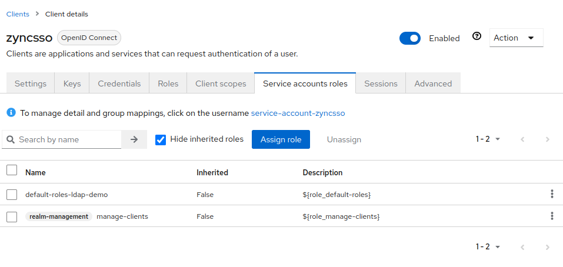
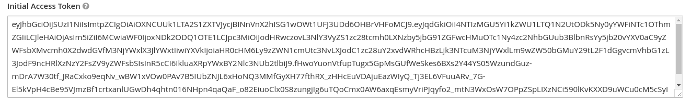
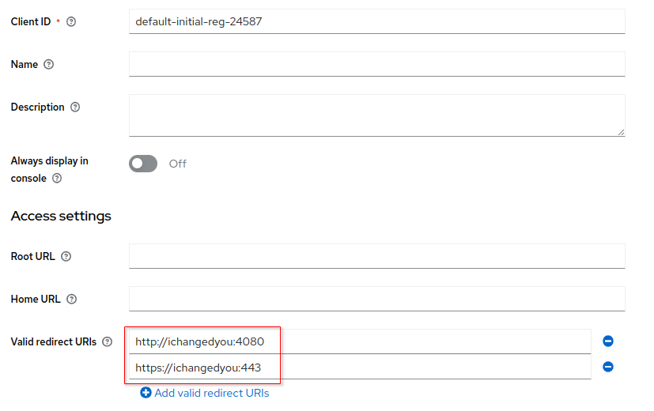

:scrollbar:
:data-uri:
:toc2:
:linkattrs:

= Dynamic Client Registration

:numbered:

== Quickstart Highlights

. Understand use case for Dynamic Client Registration
. Understand different implementation approaches for Dynamic Client Registration in RH-SSO

== Overview

=== Use Case

=== Goals
In this quickstart, a SSO client called _zyncsso_ will be configured with privildges to _manage-clients_ within the SSO realm.
Once created, this SSO client can facilitate the management of all other SSO clients within the realm.

=== Client Registration Policies

Keycloak currently supports two ways for new clients to be registered through the _Client Registration Service_.

* *Authenticated requests* - A Request to register new client must contain either Initial Access Token or Bearer Token as mentioned above.

* *Anonymous requests* - A Request to register new client doesn’t need to contain any token at all

Anonymous client registration requests are very interesting and powerful feature, however you usually don’t want that anyone is able to register new client without any limitations. 
Hence, Keycloak provides a link:https://www.keycloak.org/docs/latest/securing_apps/#_client_registration_policies[Client Registration Policy SPI], which provide a way to limit who can register new clients and under which conditions.

ifdef::showscript[]
The following table lists the Client Registration Policies: 

[%header, cols="2,7"]
|===
|Policy Id
|Description
|allowed-client-templates|When present, it allows to specify whitelist of client scopes, which will be allowed in representation of registered (or updated) client
|allowed-protocol-mappers|When present, it allows to specify whitelist of protocol mapper types, which will be allowed in representation of registered (or updated) client
|client-disabled|When present, then newly registered client will be disabled and admin needs to manually enable them
|consent-required|When present, then newly registered client will always have 'consentRequired' switch enabled
|max-clients|When present, then it won't be allowed to register new client if count of existing clients in realm is same or bigger than configured limit
|scope|When present, then newly registered client won't have full scope allowed
|trusted-hosts|Allows to specify from which hosts is user able to register and which redirect URIs can client use in it's configuration
|===

* *NOTE:*  The content of the above table was generated by executing the following: 
+
-----
cat /tmp/keycloak-serverinfo.json \
  | jq -r '.componentTypes."org.keycloak.services.clientregistration.policy.ClientRegistrationPolicy"[]' \
  | jq -r '.id + "\t\t "+ .helpText'
-----

endif::showscript[]

=== Client Registration Providers
Red Hat SSO exposes a RESTful API that among other functions allows for the creation of SSO clients.
This API is called the _Client Registration Service_.

The RH-SSO Client Registration Service includes multiple implementations (aka: _providers_) as follows: 

[%header, cols="3,4,6"]
|===
|Provider Name
|Request Payload Format
|Notes
|default|RH-SSO Client Representation (JSON)|Use when your functionality to dynamically create clients will only need to work with RH-SSO.  RH-SSO Client Representation format provides support for configuring clients exactly as they can be configured through the admin console, including for example configuring protocol mappers.
|openid-connect|OIDC link:https://openid.net/specs/openid-connect-registration-1_0.html#ClientMetadata[Client Metadata Description (JSON)]|Use when functionality to dynamically create clients needs to interoperate with multiple OIDC providers
|install|RH-SSO link:https://www.keycloak.org/docs/latest/securing_apps/#openid-connect[Client Adapter Configuration (JSON)]| Format used by _Keycloak OIDC client adapters_.
|saml2-entity-descriptor| SAML Entity Descriptor (XML)|
|===

The endpoint exposed by the Client Registration Service is as follows: 

-----
$RHSSO_URL/realms/<realm_name>/clients-regisrations/<provider name>
-----

== Dynamically Create Clients

=== As anonymous user

. Attempt to dynamically create a SSO client using the _default Keycloak Representations_  as an anonymous user :
+
-----
$ curl -v -X POST $RHSSO_URL/realms/$REALM_ID/clients-registrations/default \
    -H "Content-Type:application/json" \
    -H "Accept: application/json" \
    -d "{ \"clientId\": \"default-anon-$RANDOM\", \"redirectUris\":[\"http://changeme:4080\", \"https://changemetoo:443\"],\"standardFlowEnabled\":\"true\", \"directAccessGrantsEnabled\":\"false\",  \"serviceAccountsEnabled\":\"false\", \"publicClient\":\"false\" }"

 ...

HTTP/1.1 403 Forbidden

{"error":"insufficient_scope","error_description":"Policy 'Trusted Hosts' rejected request to client-registration service. Details: URL doesn't match any trusted host or trusted domain"}
-----

. View configs for "Trusted Hosts"
+
-----
$ podman exec -it sso /opt/keycloak/bin/kcadm.sh get components -r kc-demo -F "name,id,config(*)" -q name="Trusted Hosts"

[ {
  "id" : "439a5d2b-436f-43eb-a152-7edda257df14",
  "name" : "Trusted Hosts",
  "config" : {
    "host-sending-registration-request-must-match" : [ "false" ],
    "client-uris-must-match" : [ "true" ]
  }
} ]

-----

. Retry to POST to the _default Client Representation_ endpoint (as previous), but this time do so without specifying _redirectUris_ in the payload.  What are the results ?

=== As SSO Client with _manage-clients_ role
In this section, you will invoke the RH-SSO _/clients-registrations/default_ API using the _initial access token_ to create a new SSO client (called _zyncsso_ ).

This SSO client is configured with _manage-client_ privledges that subsequently allow it to create other SSO clients.

==== Verify ability to manage other SSO clients
. Return to the Admin Portal user interface of RHT-SSO
. Navigate to the _service account roles_ tab of the _zyncsso_ client.
. Notice the existance of the _manage-clients_ roles:
+

==== Create SSO Clients

. Acquire an access token from the _zyncsso_ client:
+
-----
$ ZYNCSSO_TKN=$(curl -X POST "$OIDC_TOKEN_URL" \
            -H "Content-Type: application/x-www-form-urlencoded" \
            -d "grant_type=client_credentials" \
            -d "client_id=zyncsso" \
            -d "client_secret=zyncsso" \
            -d "scope=openid" \
            | sed 's/.*access_token":"//g' | sed 's/".*//g')

echo $ZYNCSSO_TKN
-----

. Dynamically create a SSO client using the _openid-connect_ endpoint with the _zyncsso_ access token_ : 
+
-----
$ CLIENT_URI=$( curl -v -X POST $RHSSO_URL/realms/$REALM_ID/clients-registrations/openid-connect \
    -H "Authorization: Bearer $ZYNCSSO_TKN" \
    -H "Content-Type:application/json" \
    -H "Accept: application/json" \
    -d "{ \"client_name\": \"oidc-manage-client-$RANDOM\", \"redirect_uris\":[\"http://changeme:4080\", \"https://changeme:443\"] }" \
    | jq -r .registration_client_uri )

echo $CLIENT_URI
-----

. To create more SSO clients, you could continue to utilize $ZYNCSSO_TKN (until it expires in which case you need to acquire a new access token).  Try repeating the previous command a few times.  What are the results ?

. As per section link:https://openid.net/specs/openid-connect-registration-1_0.html#ReadRequest[4.2] of the OIDC _Client Registration_ spec, you can read the details of your new SSO client: 
+
-----
$ curl -v -X GET $CLIENT_URI \
    -H "Authorization: Bearer $ZYNCSSO_TKN"  \
    -H "Accept: application/json" \
    | jq -r .
-----

. Skim through the link:https://openid.net/specs/openid-connect-registration-1_0.html[OIDC Client Registration] spec.
+
What does it say about updating and deleting an SSO client?
+
You'll notice that the OIDC _Client Registration_ spec does not explicitly require the ability to update nor delete a SSO client.  However, in RH-SSO, both operations are available: 

.. Update the SSO client (using an HTTP POST): 
+
-----
$ curl -v -X POST $RHSSO_URL/realms/$REALM_ID/clients-registrations/openid-connect \
  -H "Authorization: Bearer $ZYNCSSO_TKN" \
  -H "Content-Type:application/json" \
  -H "Accept: application/json" \
  -d "{ \"client_name\": \"oidc-manage-client-$RANDOM\", \"redirect_uris\":[\"http://youchangedme:4080\", \"https://youchangedme:443\"]}"
-----

.. Delete the SSO client:
+
-----
$ curl -v -X DELETE $CLIENT_URI     -H "Authorization: Bearer $ZYNCSSO_TKN"      -H "Accept: application/json"
-----

=== Using _Initial_ and _Registration_ Access Tokens

==== Create Initial Access Token

To invoke either the _default_ or _openid-connect_ providers of Red Hat SSO _client registration service_ API, you need to use an  _Initial Access Token_.
In RH-SSO, an _Initial Access Token_ is configured at the _realm_ level (it's not associated with a SSO _client_ ) with an expiration time and maximum count of invocations.

This _Initial Access Token_ can be created via either the RH-SSO Admin Console or via its REST API (choose one of the following approaches):

===== Admin Console

. Navigate to *Clients -> Initial Access Tokens*.
. Click *Create*.
. Set an *Expiration* of 5 days or more and a *Count* of 100 or more, then click *Save*.
* An Initial Access Token appears:
+

. Copy the entire Initial Access Token and set it as a shell environment variable:
+
-----
export INITIAL_ACCESS_TOKEN=<generated access token from RH-SSO>
-----

===== REST API

. Using _Resource Owner Password Credentials_ flow on the _admin-cli_ SSO client, acquire a OAuth2 Bearer Access Token: 
+
-----
ADMIN_API_TKN=$(curl -X POST "$OIDC_TOKEN_URL" \
            -H "Content-Type: application/x-www-form-urlencoded" \
            -d "username=$REALM_ADMIN" \
            -d "password=$REALM_ADMIN_PASSWD" \
            -d "grant_type=password" \
            -d "client_id=admin-cli" \
            -d "scope=openid" \
            | sed 's/.*access_token":"//g' | sed 's/".*//g')

$ echo $ADMIN_API_TKN
-----

. Using the access token, invoke the _clients-initial-access_ API of RH-SSO to acquire an _initial access token_
+
-----
$ INITIAL_ACCESS_TOKEN=$(curl -X POST $RHSSO_URL/admin/realms/$REALM_ID/clients-initial-access \
    -d "{\"expiration\": 432000, \"count\": 100}" \
    -H "Content-Type:application/json" \
    -H "Accept: application/json" \
    -H "Authorization: Bearer $ADMIN_API_TKN" \
    | jq -r '.token' )
-----

==== Dynamically Create & Update SSO Client

. Generate a unique identifier for the client_id: 
+
-----
$ CLIENT_ID=default-initial-reg-$RANDOM
-----

. Dynamically create a SSO client using the _openid-connect_ endpoint with the _initial access token_ : 
+
-----
$ ZYNC_SSO_CLIENT_REG_ACCESS_TOKEN=$( curl -X POST $RHSSO_URL/realms/$REALM_ID/clients-registrations/default \
    -H "Authorization: Bearer $INITIAL_ACCESS_TOKEN" \
    -H "Content-Type:application/json" \
    -H "Accept: application/json" \
    -d "{ \"clientId\": \"$CLIENT_ID\", \"redirectUris\":[\"http://changeme:4080\", \"https://changeme:443\"],\"standardFlowEnabled\":\"true\", \"directAccessGrantsEnabled\":\"false\",  \"serviceAccountsEnabled\":\"false\", \"publicClient\":\"false\" }" \
    | jq -r .registrationAccessToken  )
-----

. View the newly generated _Registration Access Token_: 
+
-----
$ echo $ZYNC_SSO_CLIENT_REG_ACCESS_TOKEN
-----

. Dynamically create a SSO client using the _openid-connect_ endpoint with the _registration access token_ : 
+
-----
$ ZYNC_SSO_CLIENT_REG_ACCESS_TOKEN=$( curl -X PUT $RHSSO_URL/realms/$REALM_ID/clients-registrations/default/$CLIENT_ID \
    -H "Authorization: Bearer $ZYNC_SSO_CLIENT_REG_ACCESS_TOKEN" \
    -H "Content-Type:application/json" \
    -H "Accept: application/json" \
    -d "{ \"clientId\": \"$CLIENT_ID\", \"redirectUris\":[\"http://ichangedyou:4080\", \"https://ichangedyou:443\"],\"standardFlowEnabled\":\"true\", \"directAccessGrantsEnabled\":\"false\",  \"serviceAccountsEnabled\":\"false\", \"publicClient\":\"false\" }" \
    | jq -r .registrationAccessToken  )
-----

. Return to the console of the _kc-demo_ realm and notice the updated _redirect URIs_ on your dynamically generated SSO client: 
+

== Reference

. link:https://access.redhat.com/documentation/en-us/red_hat_single_sign-on/7.6/html-single/securing_applications_and_services_guide/index#client_registration[Using RH-SSO Client Registration Services]
. link:https://openid.net/specs/openid-connect-registration-1_0.html[OIDC Dynamic Client Registration 1.0]
. link:https://openid.net/wordpress-content/uploads/2018/06/OpenID-Connect-Conformance-Profiles.pdf[Dynamic OIDC provider certification, Section 2.2.5]
. link:https://datatracker.ietf.org/doc/html/rfc7591[OAuth2 Dynamic Client Registration Protocol]
. link:https://datatracker.ietf.org/doc/html/rfc7592[OAuth2 Dynamic Client Registration Management Protocol]

