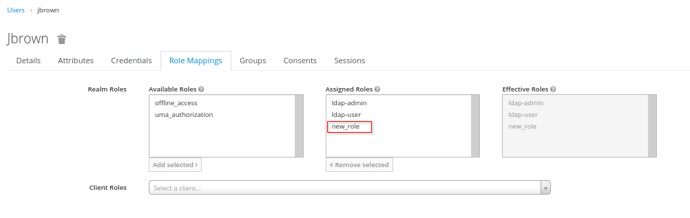
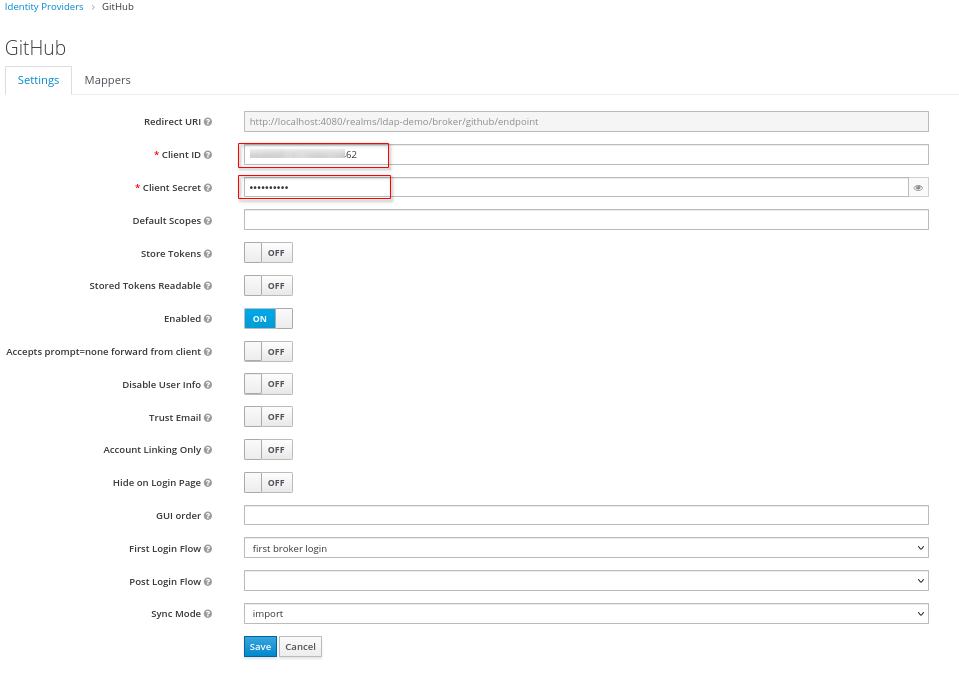

:scrollbar:
:data-uri:
:toc2:
:linkattrs:

= Federation & Identity Brokering

The purpose of this lab is to demonstrate OpenID Connect (OIDC) based security where the system of record of user and role data is maintained in external identity providers.

:numbered:

== User Federation: Periodic Synch

=== Review `openldap` configs

Scenario: 
  We don't always want to synchronize the entire ldap directory with keycloak. (we have over 100,000 people).
In this case we import the users during their first connection. Or when looking for them explicitly in the console.

`Periodic changed users sync` will import all users from LDAP.

. Notice the settings pertaining to `Periodic Sync`:
+

. Set value of `Changed Users Sync Period` to:  30

=== Verify Account Console Problem
. Authenticate into the `Account Console` of RH-SSO using the `jbrown` user: 

.. Navigate to the RH-SSO `Account Console` of your realm :
+
-----
$ echo -en "\n$RHSSO_URL/realms/$REALM_ID/account\n\n"
-----

.. Authenticate using the following credentials: 

... UserId:  `jbrown`
... Password: `password`

. Click on any of the links in the `Account Console` and notice the following error: 
+

. In the `Account Console`, log out and authenticate back in as the following user: 

.. UserId: 'bwilson'
.. Password: `password`

. Click on any of the links in the `Account Console` and notice that user does have permissions to navigate through all functionality.  What is the difference between default roles provided to each user ?

. Using the `ldapsearch` command line utility, query for members with the `manage-account` role: 
+
-----
$ ldapsearch -x \
             -h localhost \
             -p 3389 \
             -D "cn=admin,dc=example,dc=org" \
             -w admin \
             -b cn=manage-account,ou=AccountConsoleRoles,dc=example,dc=org
-----
+
The response should include the following:
+
-----
dn: cn=manage-account,ou=AccountConsoleRoles,dc=example,dc=org
objectClass: top
objectClass: groupOfNames
cn: manage-account
member: uid=bwilson,ou=People,dc=example,dc=org

-----
+
Notice that the `jbrown` user is missing as a member.

=== Modify User & Role data
In OpenLDAP, you will need to add `jbrown` as a member of the `manage-account` role.
You'll then need to sync these changes to the User store of RH-SSO.

. Using the `ldapmodify` command line utility, add the `jbrown` user as a member of the `manage-account` role: 
+
-----
$ echo "dn: cn=manage-account,ou=AccountConsoleRoles,dc=example,dc=org
changetype: modify
add: member
member: uid=jbrown,ou=People,dc=example,dc=org" \
  > /tmp/jbrown_role.ldif \
  && ldapmodify -x \
        -h localhost \
        -p 3389 \
        -D "cn=admin,dc=example,dc=org" \
        -w admin \
        -f /tmp/jbrown_role.ldif
-----
+
The response should consist of the following: 
+
-----
modifying entry "cn=manage-account,ou=AccountConsoleRoles,dc=example,dc=org"
-----

. Sync changes to RH-SSO: 
.. In the `Admin Console` of RH-SSO, navigate to:  `User Federation -> openldap`
.. Investigate the `account console roles` ldap mapper:
+
Navigate to: `mappers -> account console roles`
+

.. At the bottom of the page, click:  `Synch LDAP Roles to Keycloak`
+
NOTE:  You do not have to explicitly delete the `jbrown` user in RH-SSO.  The LDAP sync functionality of RH-SSO will auto-detect a change in LDAP and update that change in RH-SSO. 

=== Verify Fix
. Verify that the `manage-account` role is now included in an `access token` associated with the `jbrown` user.
+
You can do this numerous ways to include use of the `evaluate` screen of the RH-SSO `Admin Console`: 
+

. Authenticate into the `Account Console` of RH-SSO using the `jbrown` user.
+
You should now see the ability to navigate through all functionality.

== User Federation: New User Attribute

== User Federation: Sync Strategies

NOTE:  Change this lab such that jbrown user is given `account` client related roles.

This quickstart includes _User Federation_ configs to synchronize user data between RH-SSO and OpenLDAP.

This User Federation config specifies a _READ_ONLY_ strategy for synchronizing that user data:  user data will be pulled into RH-SSO but if/when that user data in RH-SSO changes, those changes will not be propogated back to OpenLDAP.

Details regarding the various synchronization strategies supported in RH-SSO can be found in the section _Integrating with LDAP and Active Directory_ of link:https://smile.amazon.com/Keycloak-Management-Applications-protocols-applications/dp/1800562497[Keycloak - Identity & Access Management for Modern Apps] book.

In this section of the lab, you will modify the synchronization strategy to allow changes of user data in RH-SSO to propogate to LDAP.

=== Change synch to: Writable
. Your SSO Realm includes a _User Federation_ config called:  `openldap`.
. In the _kc-demo_ realm of RH-SSO, navigate to: `User Federation -> openldap -> edit`
+
image::images/edit_user_federation.png[]

. Switch the _Edit Mode_ to:  `WRITEABLE`.
. Click `Save`

=== Test synch to LDAP

. In the _kc-demo_ realm, add a new realm role called:  _new_role_ 
+
Roles -> Add Role -> Role Name -> _new_role_

. Assocate the _new_role_ role with the _jbrown_ user:
+
Users -> _jbrown_ -> Role Mappings -> Assigned Roles -> _new_role_
+

. Execute the following to verify that the new role was synced to the remote ldap: 
+
-----
$ ldapsearch -x \
             -h localhost \
             -p 3389 \
             -D "cn=admin,dc=example,dc=org" \
             -w admin \
             -b cn=new_role,ou=RealmRoles,dc=example,dc=org
-----

. The response should include the following:
+
-----

...

# new_role, RealmRoles, example.org
dn: cn=new_role,ou=RealmRoles,dc=example,dc=org
objectClass: groupOfNames
cn: new_role
member: cn=empty-membership-placeholder
member: uid=jbrown,ou=People,dc=example,dc=org

...

-----

== Identity Brokering
Keycloak can integrate w/ 3rd party identity providers using a set of open standard protocols.  In particular, Keycloak can act as an intermediary service for authenticating and replicating users from a targeted identity provider.

In this section of the quickstart, _github_ will be used as that targeted identity provider and the protocol used to facilitate that integration will be OpenID Connect.

=== Benefits
Through identity brokering, you can provide a much better experience for users where they can leverage an existing account to authenticate and sign up in your realm.

Once these users have been created and their information has been imported from the third-party provider, they become users of your realm and can enjoy all of the features provided by Keycloak and respect the security constraints imposed by your realm.

=== github OAuth App

In this section, you will create a new OAuth client in github.

. Authenticate into github and navigate to:  `Settings -> Developer settings`.
. Click the `New OAuth App` button.
. Populate the form with the following values:
.. *Application name* : `external-idp-test`
.. *Homepage URL*: `https://github.com/redhat-na-ssa/keycloak_ldap_quickstart`
.. *Authorization callback URL*:  `http://rht:4080`
. Click `Register application`
. In the details page of the new github OAuth App, copy both the `Client ID` as well as the `client secret`
+
image::images/external-idp-settings.png[]

==== RH-SSO: github Identity Provider

. Modify both the `Client Id` as well as the `Client Secret` with the values provided in the github OAuth App
+

. Click `Save`

==== github OAuth App

In this section, you will create a new OAuth client in github.

. Authenticate into github and navigate to:  `Settings -> Developer settings`.
. Click the `New OAuth App` button.
. Populate the form with the following values:app-name:
.. *Application name* : `external-idp-test`
.. *Homepage URL*: `https://github.com/redhat-na-ssa/keycloak_ldap_quickstart`
.. *Authorization callback URL*:  `http://rht:4080`
. Click `Register application`
. In the details page of the new github OAuth App, copy both the `Client ID` as well as the `client secret`
+
image::images/external-idp-settings.png[]

==== RH-SSO: github Identity Provider

. Modify both the `Client Id` as well as the `Client Secret` with the values provided in the github OAuth App
+

. Click `Save`

== Questions: 
. What functionality is not possible when `import users` functionality is disabled in LDAP provider?
+
User search is possible as is user log in to Account Console.

.. When TOTP added: 
+
-----
# select * from federated_user;

# select credential_data, type, user_id, user_label from fed_user_credential;
-----

*Next Lab*:  Proceed to the link:README_RHSSO_Extensions.adoc[RH-SSO Extensions Lab]
