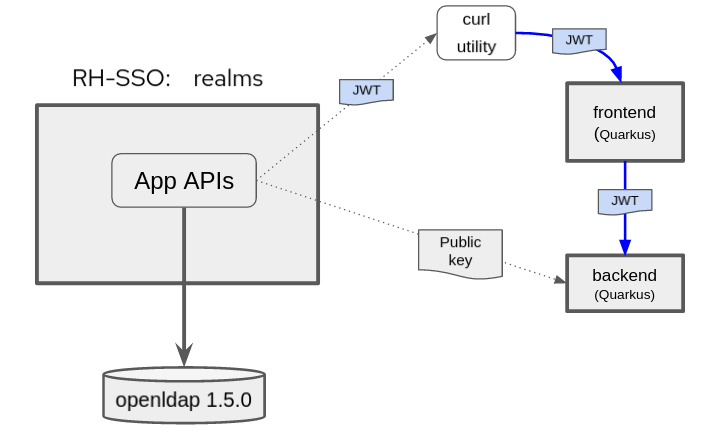

:scrollbar:
:data-uri:
:toc2:
:linkattrs:

= RH-SSO / Federation Quickstart

The purpose of this quickstart is to demonstrate OpenID Connect (OIDC) based security where the system of record of user and role data is maintained in external identity providers.

:numbered:

== Quickstart Highlights

. *Quarkus based RH-SSO*
+
Keycloak 17 is quarkus based.  In this quickstart, this version of keycloak is used and backed by a PostgreSQL database.

. *Authorization header propogation*
+
Via the _org.eclipse.microprofile.rest.client.propagateHeaders_ system property, Quarkus provides a convenient approach to specify request headers that should be propogated to downstream RESTful services via the REST client.  In this quickstart, this system property is utilzied to propogate the `Authorization` header between backend services.

. *_User Federation_ capabilities of RH-SSO*
+
In particular, the _WRITABLE_ strategy can be used to replicate any changes made to federated user data in RH-SSO back to the LDAP directory.

. *Broker Federation using RH-SSO and Github*

. *OIDC enabled web app development via _docker-compose_*

. *OIDC enabled web app deployment to OpenShift via ansible*

== Architecture

image::images/quickstart_deployment.png[]

This quickstart includes both _docker-compose_ (for a local deployment) as well as ansible (for deployment to OpenShift).
In both cases, the following containers are deployed (as per the above diagram) : 

.. *openldap*
+
System of record of user and role data.

.. *RH-SSO*
+
Provisioned with a realm enabled with _User Federation_ to openldap.

.. *Frontend* service
+
Quarkus based app that exposes REST API and invokes _backend_ service (with _Authorization_ header propogated to _backend_ service).

.. *Backend* service
+
Quarkus based app that exposes REST API secured using RBAC.
The service is enabled with a _keycloak adapter_.
At start-up, this _keycloak adapter_ acquires the SSO public key.
When a request is sent to this service, the _access token_ in the request is validated using this SSO public key. 

Once provisioned, you'll use the _curl_ utility to smoke test as per the following: 

== Local Environment
This quickstart includes a _docker-compose_ to facilitate development and testing in your local environment.

=== Pre-reqs

. *docker* or *podman*

. *docker-compose*

. *curl*

. *ldapsearch*

. *jq*

=== Environment Variables

. Set the following environment variables with values similar to the following:
+
-----
export RHSSO_HOST=sso.local
export RHSSO_URL=http://$RHSSO_HOST:4080
export RHSSO_MASTER_PASSWD=admin
export REALM_ID=ldap-demo
export SSO_CLIENT_ID=ldap-app
export ACCESS_TOKEN_URL="$RHSSO_URL/realms/$REALM_ID/protocol/openid-connect/token"
export BACKEND_ROUTE=http://localhost:6080
export FRONTEND_ROUTE=http://localhost:7080
-----

. Add the following entry to your `/etc/hosts`:
+
-----
127.0.0.1   sso.local
-----

=== Startup

. Start all linux containers for this quickstart:
+
-----
$ docker-compose -f etc/docker-compose.yaml up -d
-----

. The following containers should start:
+
-----
$ podman ps --format "{{.Image}}\t{{.Ports}}\t{{.Names}}"

registry.redhat.io/rhel8/postgresql-12:1-72.1626836556  0.0.0.0:4432->4432/tcp                          psql_sso
docker.io/osixia/openldap:1.5.0                         0.0.0.0:3389->389/tcp, 0.0.0.0:6636->636/tcp    openldap
quay.io/jbride/keycloak:17.0.0-2-psql                   0.0.0.0:4080->4080/tcp, 0.0.0.0:4443->4443/tcp  sso
quay.io/redhat_naps_da/backend-oidc:0.0.2               0.0.0.0:6080->6080/tcp                          backend-service
quay.io/redhat_naps_da/frontend-oidc:0.0.4              0.0.0.0:7080->7080/tcp                          frontend-service
quay.io/jbride/keycloak-token-inspector:0.0.1           0.0.0.0:8000->8000/tcp                          token-inspector
-----

=== RH-SSO Admin Console and Endpoints
. Open a web browser and navigate to the console of the `master` realm :
+
-----
$ echo -en "\n$RHSSO_URL/admin/master/console\n\n"
-----

. Authenticate using `admin` as the userId and the value of the `$RHSSO_MASTER_PASSWD` environment variable as the password.
. As the RH-SSO site admin, you have full access to all of its resources.
+
image::images/master_homepage.png[]

. Invoke _Discovery Endpoint_ of RH-SSO to view details of OIDC related REST APIs:
+
-----
$ curl -v -X GET "$RHSSO_URL/realms/$REALM_ID/.well-known/openid-configuration" | jq .
-----

=== Smoke Test

. View all users and roles in openldap:
+
-----
$ ldapsearch -x -h localhost -p 3389 -b dc=example,dc=org -D "cn=admin,dc=example,dc=org" -w admin
-----

. Retrieve an OAuth2 _access token_ using OAuth2 link:https://tools.ietf.org/html/rfc6749#section-4.3[Resource Owner Password Credentials] flow :
+
-----
TKN=$(curl -X POST "$ACCESS_TOKEN_URL" \
            -H "Content-Type: application/x-www-form-urlencoded" \
            -d "username=jbrown" \
            -d "password=password" \
            -d "grant_type=password" \
            -d "client_id=$SSO_CLIENT_ID" \
            -d "scope=openid" \
            | sed 's/.*access_token":"//g' | sed 's/".*//g')

$ echo $TKN
-----
+
NOTE:  By setting a `scope=openid`, the OIDC _id_token_ is also included in the response.

. By setting _fullScopeAllowed=true_ in the SSO client, all roles assocated with an authenticated user will be included in the access token.
+
These roles can be visualized as follows:
+
-----
$ jq -R 'split(".") | .[1] | @base64d | fromjson' <<< $TKN | jq .realm_access.roles

[
  "ldap-user",
  "ldap-admin"
]
-----

. Invoke backend-oidc service directly by including access token in request:
+
-----
$ curl -v -H "Authorization: Bearer $TKN" \
       -H "Accept: text/plain" \
       -X GET $BACKEND_ROUTE/backend/secured

< HTTP/1.1 200 OK
Hello jbrown with roles: ldap-user ldap-admin
-----

. Invoke frontend service (which subsequently invokes the downstream _backend-oidc_ service with _propogated_ request headers): 
+
-----
$ curl -v -H "Authorization: Bearer $TKN" \
       -X GET $FRONTEND_ROUTE/frontend

< HTTP/1.1 200 OK
Hello jbrown with roles: ldap-user ldap-admin
-----

=== Code Review Questions

. Regarding the value of $ACCESS_TOKEN_URL, what alternative REST endpoint does RH-SSO provide to authenticate as per the OIDC specification ?
.. What is included in the response when invoking that alternative OIDC endpoint ?
.. Under what circumstances should this alternative OIDC endpoint get invoked ?

. What is the configuration used in the _frontend-service_ to instruct it to propagate the _Authorization_ request header to the _backend-service_ ?

. What URL does the _backend-service_ use to configure its _keycloak adapter_ at deployment time ?

/////
Answers:

1) $RHSSO_URL/realms/$REALM_ID/protocol/openid-connect/auth
1.a) authorization code
1.b) single page javascript apps configured to authenticate with RH-SSO using OIDC link:https://docs.microsoft.com/en-us/azure/active-directory/develop/v2-oauth2-auth-code-flow[Authorization Code] flow

2) org.eclipse.microprofile.rest.client.propagateHeaders=Authorization

3) quarkus.oidc.auth-server-url=http://sso:4080/realms/ldap-demo
/////

=== Token Inspector webapp
This lab includes a simple javascript based web app to view the details of OAuth2 and OIDC tokens.

This web app was plagarized from the lab assets provided by the link:https://smile.amazon.com/Keycloak-Management-Applications-protocols-applications/dp/1800562497[Keycloak - Identity & Access Management for Modern Apps] book.
Subsequently, all credit for that web app goes to the author of that book.  Thank you!

. Open a web browser and navigate to:  http://localhost:8000
. Switch to the _Network_ tab of your _Web Developer Tools_ on that page.
+
image::images/browser_network_tools.png[]

. Click the `Login` button at the top-left corner of the page
. Notice the re-direction to the URL of the app's _SSO Realm_.  What are the request parameters?
. in the RH-SSO login form, authenticate using the following credentials:
.. *UserId* :  jbrown
.. *Password* :  password
. Notice the re-direction back to the _Token Inspector_ web app.
+
In the request to the _/token_ endpoint, what are the request parameters and what is included in the response ?

=== User Federation: Test _WRITEABLE_ strategy
This quickstart includes _User Federation_ configs to synchronize user data between RH-SSO and OpenLDAP.

This User Federation config specifies a _READ_ONLY_ strategy for synchronizing that user data:  user data will be pulled into RH-SSO but if/when that user data in RH-SSO changes, those changes will not be propogated back to OpenLDAP.

Details regarding the various synchronization strategies supported in RH-SSO can be found in the section _Integrating with LDAP and Active Directory_ of link:https://smile.amazon.com/Keycloak-Management-Applications-protocols-applications/dp/1800562497[Keycloak - Identity & Access Management for Modern Apps] book.

In this section of the lab, you will modify the synchronization strategy to allow changes of user data in RH-SSO to propogate to LDAP.

==== Change synchronization to: Writable
. Your SSO Realm includes a _User Federation_ config called:  `ldap-apacheds`.
. In the _ldap-demo_ realm of RH-SSO, navigate to: `User Federation -> ldap-apacheds -> edit`
+

. Switch the _Edit Mode_ to:  `WRITEABLE`.
. Click `Save`

==== Test synchronization to LDAP
. In the _ldap-demo_ realm, add a new realm role called:  _new_role_ 
+
Roles -> Add Role -> Role Name -> _new_role_

. Assocate the _new_role_ role with the _jbrown_ user:
+
Users -> _jbrown_ -> Role Mappings -> Assigned Roles -> _new_role_
+
image::images/new_role_added.png[]

. Execute the following to verify that the new role was synced to the remote ldap: 
+
-----
$ ldapsearch -x \
             -h localhost \
             -p 3389 \
             -b cn=new_role,ou=RealmRoles,dc=example,dc=org \
             -D "cn=admin,dc=example,dc=org" \
             -w admin
-----

. The response should include the following:app-name:
+
-----

...

# new_role, RealmRoles, example.org
dn: cn=new_role,ou=RealmRoles,dc=example,dc=org
objectClass: groupOfNames
cn: new_role
member: cn=empty-membership-placeholder
member: uid=jbrown,ou=People,dc=example,dc=org

...

-----

=== RH-SSO as an Identity Broker
Keycloak can integrate w/ 3rd party identity providers using a set of open standard protocols.  In particular, Keycloak can act as an intermediary service for authenticating and replicating users from a targeted identity provider.

In this section of the quickstart, _github_ will be used as that targeted identity provider and the protocol used to facilitate that integration will be OpenID Connect.

==== Benefits
Through identity brokering, you can provide a much better experience for users where they can leverage an existing account to authenticate and sign up in your realm.

Once these users have been created and their information has been imported from the third-party provider, they become users of your realm and can enjoy all of the features provided by Keycloak and respect the security constraints imposed by your realm.

==== github OAuth App

In this section, you will create a new OAuth client in github.

. Authenticate into github and navigate to:  `Settings -> Developer settings`.
. Click the `New OAuth App` button.
. Populate the form with the following values:app-name:
.. *Application name* : `external-idp-test`
.. *Homepage URL*: `https://github.com/redhat-na-ssa/keycloak_ldap_quickstart`
.. *Authorization callback URL*:  `http://sso.local:4080`
. Click `Register application`
. In the details page of the new github OAuth App, copy both the `Client ID` as well as the `client secret`
+
image::images/external-idp-settings.png[]

==== RH-SSO: github Identity Provider

. Modify both the `Client Id` as well as the `Client Secret` with the values provided in the github OAuth App
+
image::images/rhsso_github_idp.png[]

. Click `Save`

==== github OAuth App

In this section, you will create a new OAuth client in github.

. Authenticate into github and navigate to:  `Settings -> Developer settings`.
. Click the `New OAuth App` button.
. Populate the form with the following values:app-name:
.. *Application name* : `external-idp-test`
.. *Homepage URL*: `https://github.com/redhat-na-ssa/keycloak_ldap_quickstart`
.. *Authorization callback URL*:  `http://sso.local:4080`
. Click `Register application`
. In the details page of the new github OAuth App, copy both the `Client ID` as well as the `client secret`
+
image::images/external-idp-settings.png[]

==== RH-SSO: github Identity Provider

. Modify both the `Client Id` as well as the `Client Secret` with the values provided in the github OAuth App
+
image::images/rhsso_github_idp.png[]

. Click `Save`

== OpenShift
This quickstart includes _ansible_ to deploy to an OpenShift environment.  All of the same tests conducted in your local environment can be executed in your OpenShift environment.

=== Pre-reqs:
. _OpenShift_ cluster ( >= v 4.6 )
+
The cluster should have about 4 GBs and 2 CPUs to allocate to the resources of this quickstart.

. link:https://mirror.openshift.com/pub/openshift-v4/clients/ocp/?C=M;O=D[oc utility] corresponding to the version of your OpenShift cluster.

. _ansible-playbook_ utility installed

=== Startup

. Change directory into the _ansible_ directory of this project: 
+
-----
$ cd ansible
-----

. Execute _ansible_playbook_
+
-----
$ ansible-playbook playbooks/install.yml
-----

. The playbook provisions the following in OpenShift:

.. *rhi_idm* namespace:
... *openldap*
... *RH-SSO*

.. *user1-services* namespace: 
... *frontend* service
... *backend* service
... *token-inspector* web app

=== Environment Variables

. Set the following environment variables with values similar to the following:
+
-----
export OCP_DOMAIN=apps$(oc whoami --show-console | awk 'BEGIN{FS="apps"}{print $2}')
export RHSSO_HOST=sso-rhi-idm.$OCP_DOMAIN
export RHSSO_URL=https://$RHSSO_HOST/auth
export RHSSO_MASTER_PASSWD=$(oc get secret credential-rhsso -o json -n rhi-idm | jq -r .data.ADMIN_PASSWORD | base64 -d)
export REALM_ID=user1-ldap
export SSO_CLIENT_ID=ldap-app      # preset in realm deployed by project ansible
export ACCESS_TOKEN_URL="$RHSSO_URL/realms/$REALM_ID/protocol/openid-connect/token"
export FRONTEND_ROUTE=https://frontend-user1-services.$OCP_DOMAIN
-----

=== Testing 

All of the same tests conducted previously in your local environment can be executed in your OpenShift environment.

== Reference

. link:https://docs.google.com/presentation/d/1PQu6XKFLgEy6O5Tm_OeiFfY88PVHX7hHAypHZJRP8ew/edit#slide=id.g775d9c5cf4_0_717[slidedeck]

. https://github.com/keycloak/keycloak/tree/main/examples/ldap

. link:https://access.redhat.com/documentation/en-us/red_hat_3scale_api_management/2.10/html/operating_3scale/provision-threescale-services-via-operator[3scale Config & Provision of 3scale via Operator]

== Appendix

=== Optional:  Inspect JSON Web Tokens

. View keys of a response from RH-SSO when its `/token` endpoint is invoked:
+
-----
$ curl -X POST "$ACCESS_TOKEN_URL" \
    -H "Content-Type: application/x-www-form-urlencoded" \
    -d "username=jbrown" \
    -d "password=password" \
    -d "grant_type=password" \
    -d "client_id=$SSO_CLIENT_ID" \
    -d "scope=openid" \
    | jq -r 'keys[]'

access_token
expires_in
id_token
not-before-policy
refresh_expires_in
refresh_token
scope
session_state
token_type
-----
+
NOTE: The token format is of type link:https://datatracker.ietf.org/doc/html/rfc7515[JSON Web Signature]

. View the header of an access token: 
+
-----
$ jq -R 'split(".") | .[0] | @base64d | fromjson' <<< $TKN | jq .
-----

.. Notice a `typ` of: _JWT_ .
.. Because the access token is a JSON Web Token, its header, payload and signature can be viewed in:  https://jwt.io/