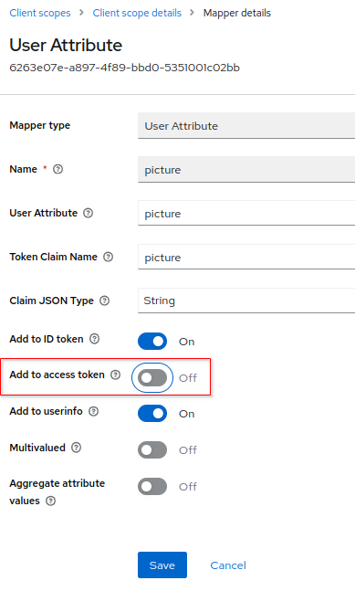

:scrollbar:
:data-uri:
:toc2:
:linkattrs:

= Token Deep Dive

:numbered:

== Token Introspection

You have a lot of options for introspecting a token.

=== RH-SSO Admin Console

The token `evaluate` functionality of the RH-SSO `Admin Console` is an excellent development & administration tool.
It allows an administrator to evaluate all token types given the current state of `client scopes` for a specific client.

image::images/evaluate_jbrown_token.png[]

=== Alternatives
The remaining token introspection options require you to first acquire a token from the `/token` endpoint of RH-SSO and then provide that token to the introspection tool.

==== Acquire Tokens

. Using the `jbrown` user, retrieve an OAuth2 access token using OAuth2 Resource Owner Password Credentials flow :
+
-----
TKN=$(curl -X POST "$OIDC_TOKEN_URL" \
            -H "Content-Type: application/x-www-form-urlencoded" \
            -d "username=jbrown" \
            -d "password=password" \
            -d "grant_type=password" \
            -d "client_id=t-inspect" \
            -d "scope=openid" \
            | sed 's/.*access_token":"//g' | sed 's/".*//g')
-----
+
You'll use this `access token` (set to the variable: $TKN) in subsequent sections of this lab.

. As per above, invocation of the `/token` endpoint did not necessitate use of a _client_secret_ data field in the request payload.  Why not ?  What would you need to modify in the SSO client such that _client_secret_ would be required in the request payload ?

==== jwt.io

Now that you have an _access_token_, you can copy and paste its content in the web app:  https://jwt.io

==== Command Line

Tokens issued by RH-SSO can be introspected at the command line using the `jq` and `base64` utilities.

. View the JWT header:
+
-----
$ jq -R 'split(".") | .[0] | @base64d | fromjson' <<< $TKN | jq .

{
  "alg": "RS256",
  "typ": "JWT",
  "kid": "mcjna6MSzQQVz6sjI_gOQYj0ByrbDLT7DthD4TnMy2U"
}
-----

. Notice a `typ` of : link:https://datatracker.ietf.org/doc/html/rfc7515[JWT] .
+
The JWT specification requires that the body of the token be encoded in base64.

. View the body of the access token
+
-----
$ jq -R 'split(".") | .[1] | @base64d | fromjson' <<< $TKN | jq .
-----

==== _/userinfo_ endpoint:

-----
$ curl -X GET "$RHSSO_URL/realms/$REALM_ID/protocol/openid-connect/userinfo" \
    -H "Content-Type: application/x-www-form-urlencoded" \
    -H "Authorization: Bearer $TKN" \
    | jq -r .

-----

==== _/token/introspect_ endpoint:

In the previous section, its been quite easy to introspect the header and payloads of tokens from RH-SSO because tokens issued by RH-SSO are encoded in base64.

Using tokens issued by alternative OIDC providers might not be so easy to work with.

If a resource server (or any other client) needs to introspect link:https://auth0.com/docs/secure/tokens/access-tokens#opaque-access-tokens[opaque access tokens] (ie: from some other Identity Provider that issues opaque access tokens), then the token `/introspect` endpoint is the answer. 

Keycloak does expose a `/token/introspect` endpoint that could be (if ever needed ... normally not) invoked as follows: 

-----
$ curl -X POST "$RHSSO_URL/realms/$REALM_ID/protocol/openid-connect/token/introspect" \
    -H "Content-Type: application/x-www-form-urlencoded" \
    -d "client_id=bservice" \
    -d "client_secret=password" \
    -d "token=$TKN" \
    | jq -r .
-----

== Token Types & Attributes

=== `/token` response

. View keys of a response from RH-SSO when its `/token` endpoint is invoked:
+
-----
$ curl -X POST "$OIDC_TOKEN_URL" \
    -H "Content-Type: application/x-www-form-urlencoded" \
    -d "username=jbrown" \
    -d "password=password" \
    -d "grant_type=password" \
    -d "client_id=t-inspect" \
    -d "scope=openid" \
    | jq -r 'keys[]'

access_token
expires_in
id_token
not-before-policy
refresh_expires_in
refresh_token
scope
session_state
token_type
-----

. From the listing above, what are the 3 different tokens that are included in the response from the `/token` endpoint ?
. Re-execute the above command without the request payload data field: "scope=openid" .
+
Which token is no longer included in the response ?

=== `picture` attribute

=== roles attributes
==== Overview

Roles are added to an _access_token_ when the following all of the following conditions occur:

* The SSO client is enabled with a `client scope` called `roles`.  ie: 
+

* The SSO client is configured with either `Full scope allowed` or a list of `role scope mappings`.
+
You'll configure these roles in the next section.

* The authenticated user for which the token is being issued has been enabled with realm and/or client roles that correspond to the configured `role scope mappings`.

When the above conditions are met, an `access_token` will include `realm_access` and/or `resource_access` attributes similar to the following: 

-----
  "realm_access": {
    "roles": [
      "ldap-user"
    ]
  },
  "resource_access": {
    "account": {
      "roles": [
        "manage-account",
        "manage-account-links"
      ]
    }
  }
-----

==== Role Scope Mappings
. In the RH-SSO `Admin Console`, navigate to: `Clients -> t-inspect -> Client Scopes -> t-inspect-dedicated -scope`
+

. Click: `Assign role`
.  Assign the following realm roles:app-name:
.. *ldap-admin*
.. *ldap-user*
. Assign the following role from the `account` SSO client:  *manage-account*
+

. Your list of `role scope mappings` should now consist of the following: 
.. *ldap-admin*
.. *ldap-user*
.. *manage account*

==== Introspect token

Compare and contrast the role related attributes included in tokens for the following users: 

. `jbrown`
. `ssoRealmAdmin`
. `bwilson`

== Bearer Token Propogation
This section of the lab is based on the following documentation:  link:https://quarkus.io/guides/security-openid-connect[Quarkus: Using OIDC to Protect Service Apps Using Bearer Token Authorization]

Via the _org.eclipse.microprofile.rest.client.propagateHeaders_ system property, Quarkus provides a convenient approach to specify request headers that should be propogated to downstream RESTful services via the REST client.  In this quickstart, this system property is utilzied to propogate the `Authorization` header between backend services.

=== Architecture
In this lab, you'll use the _curl_ utility to smoke test as per the following: 

image::images/quickstart_data_flow.png[]

=== Procedure

. View all users and roles in openldap:
+
-----
$ ldapsearch -x -h localhost -p 3389 -b dc=example,dc=org -D "cn=admin,dc=example,dc=org" -w admin
-----

. Retrieve an OAuth2 _access token_ using OAuth2 link:https://tools.ietf.org/html/rfc6749#section-4.3[Resource Owner Password Credentials] flow :
+
-----
TKN=$(curl -X POST "$OIDC_TOKEN_URL" \
            -H "Content-Type: application/x-www-form-urlencoded" \
            -d "username=jbrown" \
            -d "password=password" \
            -d "grant_type=password" \
            -d "client_id=t-inspect" \
            -d "scope=openid" \
            | sed 's/.*access_token":"//g' | sed 's/".*//g')

$ echo $TKN
-----

. Invoke backend-oidc service directly by including access token in request:
+
-----
$ curl -v -H "Authorization: Bearer $TKN" \
       -H "Accept: text/plain" \
       -X GET $BACKEND_ROUTE/backend/secured

< HTTP/1.1 200 OK
Hello jbrown with roles: ldap-user ldap-admin
-----

. Invoke frontend service (which subsequently invokes the downstream _backend-oidc_ service with _propogated_ request headers): 
+
-----
$ curl -v -H "Authorization: Bearer $TKN" \
       -X GET $FRONTEND_ROUTE/frontend

< HTTP/1.1 200 OK
Hello jbrown with roles: ldap-user ldap-admin
-----

=== Review Questions

. Regarding the value of $OIDC_TOKEN_URL, what alternative REST endpoint does RH-SSO provide to authenticate as per the OIDC specification ?
.. What is included in the response when invoking that alternative OIDC endpoint ?
.. Under what circumstances should this alternative OIDC endpoint get invoked ?

. What is the configuration used in the _frontend-service_ to instruct it to propagate the _Authorization_ request header to the _backend-service_ ?

. What URL does the _backend-service_ use to configure its _keycloak adapter_ at deployment time ?

/////
Answers:

1) $RHSSO_URL/realms/$REALM_ID/protocol/openid-connect/auth
1.a) authorization code
1.b) single page javascript apps configured to authenticate with RH-SSO using OIDC link:https://docs.microsoft.com/en-us/azure/active-directory/develop/v2-oauth2-auth-code-flow[Authorization Code] flow

2) org.eclipse.microprofile.rest.client.propagateHeaders=Authorization

3) quarkus.oidc.auth-server-url=http://sso:4080/realms/kc-demo
/////

== Offline Tokens

. Enable the `ssoRealmAdmin` user with the `offline_access` role:
+

. Acquire an offline token: 
+
-----
O_TKN=$(curl -X POST "$OIDC_TOKEN_URL" \
            -H "Content-Type: application/x-www-form-urlencoded" \
            -d "username=$REALM_ADMIN" \
            -d "password=$REALM_ADMIN_PASSWD" \
            -d "grant_type=password" \
            -d "client_id=t-inspect" \
            -d "scope=openid offline_access" \
            | sed 's/.*refresh_token":"//g' | sed 's/".*//g')

$ echo $O_TKN
-----
+
Notice the following regarding the above command: 

.. A filter for the `refresh_token` was piped from the response of the `/token` endpoint.
+
This is your _offline_ token.
 
.. Authentication was required to acquire this _offline_ token.
From hear on out, subsequent _access_ and _id_ tokens can be acquired with only this _offline_ token.  Authentication will not be needed.

. Notice that the token's type is:  Offline 
+
-----
$ jq -R 'split(".") | .[1] | @base64d | fromjson' <<< $O_TKN | jq -r .typ

Offline
-----
+
Related:  What is the expiration date on your offline token ?

. Creation of an offline token will create records in both the `offline_client_session` and `offline_client_tokens` tables.  These records can be viewed as follows: 

.. Acquire a terminal to the PostgreSQL container corresponding to RH-SSO.

.. At the command line prompt, execute:  `psql sso`

.. At the `psql` prompt, execute the following: 
+
-----
sso=# \x on
Expanded display is on.

sso=# select * from offline_client_session;
-[ RECORD 1 ]-----------+-------------------------------------------------------------------------------------------------------------------------------------------------------------------------------
user_session_id         | 3b067a4e-7d4d-4c11-9a4a-913f698b5244
client_id               | 846f5d7b-6be9-4319-800a-b0a1cc9410a2
offline_flag            | 1
timestamp               | 1667315616
data                    | {"authMethod":"openid-connect","notes":{"iss":"http://sso.local:4080/realms/kc-demo","startedAt":"1667315616","level-of-authentication":"-1","scope":"openid offline_access"}}
client_storage_provider | local
external_client_id      | local
-----

.  Using the `offline` token, acquire a new set of tokens using the _grant_type_ of _refresh_token_: 
+
-----
TKN=$( curl -X POST $OIDC_TOKEN_URL \
       -H "Content-Type: application/x-www-form-urlencoded" \
       -d "grant_type=refresh_token" \
       -d "client_id=t-inspect" \
       -d "refresh_token=$O_TKN" \
       | sed 's/.*access_token":"//g' | sed 's/".*//g')
-----

. Notice the expiration date of this access token: 
+
-----
$ TS=$(jq -R 'split(".") | .[1] | @base64d | fromjson' <<< $TKN | jq -r '.exp') && date -d"@$TS"

Tue Nov  1 09:35:54 AM MDT 2022
-----

. While this access token remains valid, use it to invoke any RESTful endpoint of the RH-SSO Admin API: 
+
-----
$ curl -v -X GET \
       -H "Authorization: Bearer $TKN" \
       -H "Accept: application/json" \
       $RHSSO_URL/admin/realms/$REALM_ID/client-scopes | jq -r .
-----

*Next Lab*:  Proceed to the link:README_federation.adoc[RH-SSO User Federation Lab]
