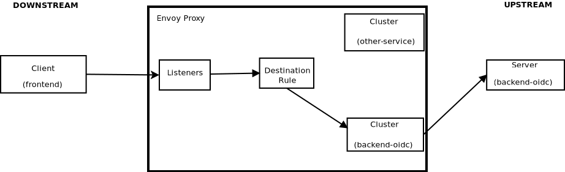

:scrollbar:
:data-uri:
:toc2:
:linkattrs:

= OSSM / SSO / API Mgmt Integrations

:numbered:

== OSSM Pre-reqs

=== Environment Variables

. Set the following environment variables with values similar to the following:
+
-----
export OCP_DOMAIN=apps$(oc whoami --show-console | awk 'BEGIN{FS="apps"}{print $2}')
export RHSSO_HOST=sso-rhi-idm.$OCP_DOMAIN
export RHSSO_URL=https://$RHSSO_HOST/auth
export RHSSO_MASTER_PASSWD=$(oc get secret credential-rhsso -o json -n rhi-idm | jq -r .data.ADMIN_PASSWORD | base64 -d)
export REALM_ID=user1-ldap
export SSO_CLIENT_ID=t-inspect      # preset in realm deployed by project ansible
export ACCESS_TOKEN_URL="$RHSSO_URL/realms/$REALM_ID/protocol/openid-connect/token"
export INGRESS_HOST=secure-ingress.$OCP_DOMAIN
export SM_CP_NS=admin1-istio-system
-----

=== OSSM Control Plane
You'll need _OpenShift Service Mesh_ installed in your OCP cluster.

For the purpose of this quickstart, it's assumed that the istio control plane is installed in a namespace called:  `admin1-istio-system`.  
If your service mesh control plane is not in the `admin1-istio-system`, change the value of `$SM_CP_NS` (set in the previous section).

If you have not yet installed OSSM on your cluster, please see the Appendix of this quickstart.

Optional: A more detailed review of the OSSM control plane can be found in the Appendix of this quickstart.

=== `istioctl`

Some exercises in this quickstart use the `istioctl` Istio command line tool. +
You can ownload the upstream Istio distribution from link:https://github.com/istio/istio/releases/tag/1.9.9[]. 

Make sure to download the _1.9.9_ version, which corresponds with the upstream Istio version that Red Hat Service Mesh is based on.

Extract the archive to a directory on your $PATH.

Verify the version of OSSM that is installed by executing the following at the command line: 

-----
$ istioctl version --remote=true -i $SM_CP_NS

client version: 1.9.9
control plane version: OSSM_2.1.2-4.el8
data plane version: 1.9.9 (4 proxies)
-----

=== `ServiceMeshMemberRoll`

. Note the existence of an empty ServiceMeshMemberRoll resource called default:
+
-----
$ oc get ServiceMeshMemberRoll default -o template --template='{{"\n"}}{{.spec}}{{"\n\n"}}' -n $SM_CP_NS

map[]
-----

. Register the `user1-services` namespace as a member to be monitored and managed by your service mesh control plane:
+
-----
$ echo "apiVersion: maistra.io/v1
kind: ServiceMeshMemberRoll
metadata:
  name: default
spec:
  members:
  - user1-services" | oc apply -n $SM_CP_NS -f -
-----

* NOTE:  The `ServiceMeshMemberRoll` resource exists in the service mesh control plane, which is typically owned by either a cluster-admin or service mesh admin.

. Verify that your `user1-services` namespace now includes `kiali` and `maistra` annotations:
+
-----
$ echo -en "\n\n$(oc get project user1-services -o template --template='{{.metadata.labels}}')\n\n"
-----
+
.Sample Output
-----
map[kiali.io/member-of:admin1-istio-system kubernetes.io/metadata.name:user1-services maistra.io/member-of:admin1-istio-system olm.operatorgroup.uid/df105b19-bc40-4fcc-8fe2-f2c41bb19999:]
-----

. Verify that your `user1-services` namespace now includes namespace-scoped `RoleBinding` resources associated with the Istio-related service accounts from your specific service mesh control plane:
+
-----
$ oc get RoleBinding  -n user1-services -l release=istio
NAME                                       ROLE                                                       AGE
istio-egressgateway-sds                    Role/istio-egressgateway-sds                               13d
istio-ingressgateway-sds                   Role/istio-ingressgateway-sds                              13d
istiod-full-install-admin1-istio-system    ClusterRole/istiod-full-install-admin1-istio-system        13d
istiod-internal-full-install               Role/istiod-internal-full-install                          13d
prometheus-admin1-istio-system             ClusterRole/prometheus-admin1-istio-system                 13d
wasm-cacher-full-install                   ClusterRole/wasm-cacher-full-install-admin1-istio-system   13d
wasm-cacher-registry-viewer-full-install   ClusterRole/registry-viewer                                13d
-----
* The use of a project-scoped `RoleBinding` resource, rather than a cluster-scoped `ClusterRoleBinding` resource, is a key enabler of the _multi-tenant_ capabilities of Red Hat^(R)^ OpenShift^(R)^ Service Mesh.

* OpenShift Service Mesh configures each member project to ensure network access between itself, the control plane, and other member projects.

. Verify that your `$ERDEMO_NS` namespace now also includes a `NetworkPolicy` resource called `istio-mesh`:
+
-----
$ oc get NetworkPolicy istio-mesh-full-install -n $ERDEMO_NS
-----
+
.Sample Output
-----
NAME                      POD-SELECTOR   AGE
istio-mesh-full-install   <none>         59m
-----
* This `NetworkPolicy` resource allows ingress to all pods specific to this namespace from all other registered members of the same OpenShift Service Mesh control plane.

=== Opt In Auto-Injection Annotations

When deploying an application into Red Hat OpenShift Service Mesh, you must opt in to injection of the Envoy _data plane_ for each deployment.
You do so by specifying the `sidecar.istio.io/inject: "true"` annotation in your deployment.

Opting in ensures that the sidecar injection does not interfere with other OpenShift capabilities (such as S2I builder pods) that likely do not need to be managed by the service mesh.

In this section of the quickstart, you opt in a selective list of deployments for auto injection of a sidecar.

. Add the _frontend_ deployment to the service mesh:
+
-----
  echo "apiVersion: apps.openshift.io/v1
kind: DeploymentConfig
metadata:
  name: frontend
spec:
  template:
    metadata:
      annotations:
        sidecar.istio.io/inject: \"true\"" \
  | oc apply -n user1-services -f -
-----

. Add the _backend_ deployment to the service mesh:
+
-----
echo "apiVersion: apps.openshift.io/v1
kind: DeploymentConfig
metadata:
  name: backend-oidc
spec:
  template:
    metadata:
      annotations:
        sidecar.istio.io/inject: \"true\"" \
  | oc apply -n user1-services -f -
-----

. After adding the annotations, the list of application pods should be similar to the following:
+
-----
$ oc get pods -l appgroup=quarkus -n user1-services
-----
+
.Sample Output
-----
NAME                   READY   STATUS    RESTARTS   AGE
backend-oidc-2-b6rzs   2/2     Running   0          82s
frontend-2-8zq5q       2/2     Running   0          93s
-----
* Note that each of these pods indicates that two containers have started.

. Use a script similar to this to identify a list of container names for each of the pods:
+
-----
$ for POD_NAME in $(oc get pods -n user1-services -l appgroup=quarkus -o jsonpath='{range .items[*]}{.metadata.name}{"\n"}')
do
    oc get pod $POD_NAME  -n user1-services -o jsonpath='{.metadata.name}{"    :\t\t"}{.spec.containers[*].name}{"\n"}'
done
-----
+
.Sample Output
-----
backend-oidc-2-b6rzs    :		backend-oidc     istio-proxy
frontend-2-8zq5q        :		frontend         istio-proxy
-----

* Note that each pod now contains an additional `istio-proxy` container colocated with the primary business service container.
* OpenShift Service Mesh uses a Kubernetes link:https://kubernetes.io/docs/reference/access-authn-authz/admission-controllers/#mutatingadmissionwebhook[`MutatingAdmissionWebhook`] for automatically injecting the sidecar proxy into user pods.  More information can be found in the Appendix of this quickstart.

== Explore Envoy Data Plane

=== Review Architecture
Envoy has many features useful for inter-service communication.
To help understand Envoy's features and capabilities, you need to be familiar with the following terminology:

* *Listeners*: Listeners expose a port to the outside world into which an application can connect--for example, a listener on port 8080 accepts traffic and applies any configured behavior to that traffic.

* *Routes*: Routes are rules for how to handle traffic that comes in on listeners--for example, if a request comes in and matches `/backend-oidc`, the route directs that traffic to the backend-oidc _cluster_.

* *DestinationRule*: A `DestinationRule` resource defines policies that apply to traffic intended for a service after routing has occurred.

* *Clusters*: Clusters are specific upstream services to which Envoy can direct traffic--for example, if `backend-oidc-v1` and `backend-oidc-v2` are separate clusters, _routes_ can specify rules about how traffic is directed to either `v1` or `v2` of the _backend-oidc_ service.

Traffic comes from a downstream system into Envoy via a listener.
This traffic is routed to one of Envoy's clusters, which is responsible for sending that traffic to an upstream system.
Downstream to upstream is how traffic always flows through Envoy.

{nbsp}
{nbsp}

=== Envoy Proxy troubleshooting

. Set the log level of the _wasm_ and _http_ modules of _istio-proxy_ to debug: 
+
-----
$ oc rsh $(oc get pod | grep "^frontend" | awk '{print $1}') curl -X POST http://localhost:15000/logging?wasm=debug \
  && oc rsh $(oc get pod | grep "^frontend" | awk '{print $1}') curl -X POST http://localhost:15000/logging?http=debug
-----

. In a new terminal, tail the log file of the _frontend_ pod's _istio-proxy_ container: 
+
-----
$ oc logs -c istio-proxy -f $(oc get pod | grep "^frontend" | awk '{print $1}')
-----

. Optional:  Advanced envoy debugging:
.. Using the _istioctl_ utility, execute the following:
+
-----
$ istioctl dashboard envoy $(oc get pod | grep "^frontend" | awk '{print $1}').user1-services
-----
.. Navigate to _config_dump_

== Restrict User Access Via OSSM & RH-SSO

=== Use Istio native mechanisms for JWT-based authorization
The purpose of this quickstart is to demonstrate exposure of a REST API deployed in OSSM where the request must include a valid JWT.

. Delete existing _frontend_ route:
+
-----
$ oc delete route frontend -n user1-services
-----

. Create route that targets istio ingress gateway:
+
-----
$ sed "s|%INGRESS_HOST%|$INGRESS_HOST|" ./ossm/base/ingress-route.yml |  oc apply -n admin1-istio-system -f -
-----

. Create gateway:
+
-----
$ sed "s|%INGRESS_HOST%|$INGRESS_HOST|" ./ossm/app/frontend-gw.yml |  oc apply -n user1-services -f -
-----

. Create virtual service:
+
-----
$ sed "s|%INGRESS_HOST%|$INGRESS_HOST|" ./ossm/app/frontend-vs.yml |  oc apply -n user1-services -f -
-----

. Retrieve token from RH-SSO:
+
-----
$ TKN=$(curl -X POST "$ACCESS_TOKEN_URL" \
            -H "Content-Type: application/x-www-form-urlencoded" \
            -d "username=jbrown" \
            -d "password=password" \
            -d "grant_type=password" \
            -d "client_id=$SSO_CLIENT_ID" \
            -d "scope=openid" \
            | sed 's/.*access_token":"//g' | sed 's/".*//g')
-----

. Invoke frontend service via istio ingress gateway:
+
-----
$ curl -v -H "Authorization: Bearer $TKN"        -X GET https://$INGRESS_HOST/frontend
-----

. Inspect JWT:
+
-----
$ jq -R 'split(".") | .[1] | @base64d | fromjson' <<< $TKN > /tmp/jwt.json

$ cat /tmp/jwt.json
-----

. Create RequestAuthentication and AuthorizationPolicy to only allow requests with valid JWT:
+
-----
$ sed "s|%RHSSO_URL%|$RHSSO_URL|" ./ossm/app/frontend-request-auth.yml \
    | sed "s|%REALM_ID%|$REALM_ID|" \
    |  oc apply -n user1-services -f -
-----

. NOT NEEDED:  Create external serviceentry to RH-SSO:
+
-----
$ sed "s|%RHSSO_HOST%|$RHSSO_HOST|" ./ossm/sso/keycloak-serviceentry.yml \
    |  oc apply -n user1-services -f -
-----

. Start keycloak-token-inspector:
+
-----
$ cd keycloak-token-inspector

$ export KC_URL=$RHSSO_URL \
  && export KC_REALM_ID=$REALM_ID \
  && export SERVICE_URL=https://$INGRESS_HOST/frontend \
  && npm start
-----

=== Inject oauth2-proxy in Istio ingress gateway to implement an OIDC workflow

TO-DO

=== Reference

. link:https://rpscodes.github.io/OpenShift-Service-Mesh-and-3scale-API-Management-Integration/rhs-openshift-starter-guides/4/introduction.html[OSSM & 3scale Integration];  May 2022

. link:https://cloud.redhat.com/blog/restricting-user-access-via-service-mesh-2.0-and-red-hat-single-sign-on[Restricting User Access Via Service Mesh 2.0 & RH-SSO]
+
Appears need to upgrade to:
+
https://github.com/oauth2-proxy/oauth2-proxy/blob/master/docs/docs/configuration/auth.md#keycloak-oidc-auth-provider
+
Discuss three different approaches:

.. Approach 1: Using Istio native mechanisms for JWT-based authorization
.. Approach 2: Injecting oauth2-proxy container inside the Istio ingress gateway to implement an OIDC workflow
.. Approach 3: Combining JWT-based authorization and OIDC workflow

. link:https://homelab.blog/blog/devops/Istio-OIDC-Config/[Configuring Istio w/ OIDC Authentication]
+
Makes use of "oidc" provider of oauth2-proxy rather than "keycloak" provider.
+
Introduces a Redis database as a workaround for an apparent bug at the time.
+
Uses what seems to be an old container image:  quay.io/pusher/oauth2_proxy:v4.1.0

. link:https://medium.com/@senthilrch/api-authentication-using-istio-ingress-gateway-oauth2-proxy-and-keycloak-a980c996c259[Ingress GW, OAuth2-Proxy and RH-SSO  .... similar to previous link]

. link:https://github.com/RedHatGov/service-mesh-workshop-dashboard/blob/main/workshop/content/lab5.4_authpolicy.md[Lab:  Authorizing and Authenticating Access via Policy]

== Apply API Policies to Ingress Gateway traffic

=== Reference

. https://github.com/3scale-demos/ossm-3scale-wasm.git
. https://developers.redhat.com/articles/2021/12/06/custom-webassembly-extensions-openshift-service-mesh[Satya's writeup]
. https://github.com/3scale/threescale-wasm-auth/[github: threescale-wasm-auth]
. link:https://quay.io/repository/3scale/threescale-wasm-auth?tab=tags&tag=latest[3scale WASM container images]

=== Procedure

. View list of tags for _3scale-auth-wasm_rhel8_ container image: 
+
-----
$ skopeo login registry.redhat.io -u <userId> -p <passwd>

$ skopeo list-tags docker://registry.redhat.io/openshift-service-mesh/3scale-auth-wasm-rhel8

-----

. Set Environment Variables: 
+
-----
# export TENANT_SECRET=adprod-generated-secret  # only applicable for fix in 3scale 2.12
export TENANT_SECRET=adprod-atoken-secret  # appropriate for 3scale 2.11
export TENANT_ADMIN_HOST=$(oc get secret $TENANT_SECRET -o json -n rhi-apimgmt | jq '.data.adminURL' -r | base64 -d | sed 's/https:\/\///' )
export TENANT_ACCESS_TOKEN=$(oc get secret $TENANT_SECRET -o json -n rhi-apimgmt | jq '.data.token' -r | base64 -d)
export API_MGMT_BACKEND_HOST=$( oc get route backend -n rhi-apimgmt --template='{{ .spec.host }}' )
export API_SERVICE_ID=$(oc get product adprod-quarkus-product -n rhi-apimgmt -o json | jq .status.productId)
export API_SERVICE_TOKEN=$( curl https://$TENANT_ACCESS_TOKEN@$TENANT_ADMIN_HOST/admin/api/services/$API_SERVICE_ID/proxy/configs/production/latest.json | jq -r '.proxy_config.content.backend_authentication_value'  )
export API_APP_ID=CHANGEME
-----

. Create a ServiceEntry allowing API gateway WASM to invoke 3scale Admin Provider URL: 
+
-----
$ sed "s|%TENANT_ADMIN_HOST%|$TENANT_ADMIN_HOST|" ./ossm/3scale-wasm/serviceentry-adminURL.yml |  oc apply -n user1-services -f -
-----

. Create a ServiceEntry allowing API gateway WASM to invoke 3scale backend URL: 
+
-----
$ sed "s|%API_MGMT_BACKEND_HOST%|$API_MGMT_BACKEND_HOST|" ./ossm/3scale-wasm/serviceentry-backendURL.yml |  oc apply -n user1-services -f -
-----
+
NOTE:  Without this ServiceEntry, an error will appear in the _envoy-proxy_ logs similar to the following: 
+
-----
error	envoy wasm	wasm log:    233614343 (1/http): on_http_request_headers: could not dispatch HTTP call to outbound|443||backend-3scale.apps.den.ratwater.xyz: did you create the cluster to do so? - "failed to dispatch HTTP (https) call to cluster outbound|443||backend-3scale.apps.den.ratwater.xyz with authority backend-3scale.apps.den.ratwater.xyz: BadArgument"

-----

. Create DestinationRule :
+
-----
$ sed "s|%API_MGMT_BACKEND_HOST%|$API_MGMT_BACKEND_HOST|" ./ossm/3scale-wasm/destinationrule.yml |  oc apply -n user1-services -f -
-----

. Create a new ServiceMeshExtension: 
+
-----
$ . ossm/3scale-wasm/servicemeshextension.yml | oc apply -n user1-services -f -
-----
+
NOTE: In the logs of the _istio-proxy_, you might see warnings such as the following: 
+
-----
2022-04-27T21:39:08.178317Z	warning	envoy wasm	wasm log threescale-wasm-adprod_root :  (root/1)  331943116: on_vm_start: empty VM config
2022-04-27T21:39:08.206972Z	warning	envoy wasm	wasm log threescale-wasm-adprod_root :  (root/1) 3991748476: on_vm_start: empty VM config
2022-04-27T21:39:08.207477Z	warning	envoy wasm	wasm log threescale-wasm-adprod_root :  (root/1) 1626258163: on_vm_start: empty VM config
2022-04-27T21:39:08.207534Z	warning	envoy wasm	wasm log threescale-wasm-adprod_root :  (root/1)  307150597: on_vm_start: empty VM config

-----
+
These warnings are benign and can be ignored.
What you should not see are any errors in the log.

. Retrieve token from RH-SSO:
+
-----
$ TKN=$(curl -X POST "$ACCESS_TOKEN_URL" \
            -H "Content-Type: application/x-www-form-urlencoded" \
            -d "username=jbrown" \
            -d "password=password" \
            -d "grant_type=password" \
            -d "client_id=$API_APP_ID" \
            -d "scope=openid" \
            | sed 's/.*access_token":"//g' | sed 's/".*//g')
-----

. Invoke frontend service via istio ingress gateway:
+
-----
$ curl -v -H "Authorization: Bearer $TKN"        -X GET https://$INGRESS_HOST/frontend
-----

. Existing error when servicemeshextension configured to use https to backend:

.. logs: 
+
-----
}
2022-04-28T02:03:48.058188Z	debug	envoy wasm	wasm log:    1625927304 (1/http): matched pattern in /frontend
2022-04-28T02:03:48.058378Z	info	envoy wasm	wasm log: calling out outbound|443||backend-3scale.apps.den.ratwater.xyz (using https scheme) with headers -> [(":authority", "backend-3scale.apps.den.ratwater.xyz"), (":scheme", "https"), (":method", "GET"), (":path", "/transactions/authrep.xml?service_id=13&service_token=ea06d62d7cb0659140d0b31384f789a9464934feedf478fe8030933529e331f4&app_id=84493d52&usage[hits]=1"), ("3scale-options", "no_body=1"), ("User-Agent", "threescalers/0.8.0")] <- and body -> "(nothing)" <-
2022-04-28T02:03:48.059140Z	info	envoy wasm	wasm log:     1625927304 (1/http): on_http_request_headers: call token is 4
2022-04-28T02:03:48.060876Z	info	envoy wasm	wasm log:     1625927304 (1/http): http_ctx: on_http_call_response: token id is 4
2022-04-28T02:03:48.060927Z	info	envoy wasm	wasm log:     1625927304 (1/http): on_http_call_response: forbidden 4
2022-04-28T02:03:48.060953Z	debug	envoy wasm	wasm log:    1625927304 (1/http): 403 sent

-----

.. Jiras

... link:https://github.com/3scale/threescale-wasm-auth/issues/79[79].
... link:https://issues.redhat.com/browse/THREESCALE-7919[THREESCALE-7919]

== Appendix

=== Optional: Install OSSM
Instructions for installing OpenShift Service Mesh are as follows:

. Install operators:
+
-----
$ oc apply -f ossm/base/0-operator-subscription.yaml 
-----

. Create namespace where OSSM control plane will reside:
+
-----
$ oc new-project admin1-istio-system
-----

. Create ServiceMeshControlPlane resource:
+
-----
$ oc apply -f ossm/base/smcp.yml -n admin1-istio-system
-----

=== Optional: Review OSSM Resources
. Examine the service mesh control plane deployments:
+
-----
$ oc get deployments -n $SM_CP_NS
-----
+
.Sample Output
-----
NAME                        READY   UP-TO-DATE   AVAILABLE   AGE
grafana                     1/1     1            1           163m
istio-egressgateway         1/1     1            1           163m
istio-ingressgateway        1/1     1            1           163m
istiod-full-install         1/1     1            1           167m
jaeger                      1/1     1            1           163m
kiali                       1/1     1            1           162m
prometheus                  1/1     1            1           163m
wasm-cacher-full-install    1/1     1            1           163m
-----

. Examine the `ServiceMeshControlPlane` custom resource:
+
-----
$ oc get ServiceMeshControlPlane -n $SM_CP_NS
-----
+
.Sample Output
-----
NAME           READY     STATUS            PROFILES    VERSION   AGE
full-install   10/10     ComponentsReady   ["default"] 2.1.2   168m
-----

. Note the existence of a _PeerAuthentication_ resource called `default` in the service mesh control plane. This resource manages mesh-wide MUTUAL TLS mode, which is set to `PERMISSIVE`:
+
-----
$ oc get PeerAuthentication -n $SM_CP_NS
-----
+
.Sample Output
-----
NAME                            MODE         AGE
default                         PERMISSIVE   35m
disable-mtls-jaeger-collector   DISABLE      34m
grafana-ports-mtls-disabled     PERMISSIVE   34m
-----

. Examine the various namespace-scoped `RoleBinding` resources in the service mesh control plane:
+
-----
$ oc get RoleBinding -n $SM_CP_NS
-----
+
.Sample Output
-----
NAME                                       ROLE                                                       AGE
admin                                      ClusterRole/admin                                          15d
istio-egressgateway-sds                    Role/istio-egressgateway-sds                               15d
istio-ingressgateway-sds                   Role/istio-ingressgateway-sds                              15d
istiod-full-install-admin1-istio-system    ClusterRole/istiod-full-install-admin1-istio-system        15d
istiod-internal-full-install               Role/istiod-internal-full-install                          15d
kiali                                      Role/kiali                                                 15d
kiali-controlplane                         Role/kiali-controlplane                                    15d
mesh-users                                 Role/mesh-user                                             15d
prometheus-admin1-istio-system             ClusterRole/prometheus-admin1-istio-system                 15d
system:deployers                           ClusterRole/system:deployer                                15d
system:image-builders                      ClusterRole/system:image-builder                           15d
system:image-pullers                       ClusterRole/system:image-puller                            15d
wasm-cacher-full-install                   ClusterRole/wasm-cacher-full-install-admin1-istio-system   15d
wasm-cacher-registry-viewer-full-install   ClusterRole/registry-viewer                                15d
-----
+
NOTE: The use of a project-scoped `RoleBinding` resource rather than a cluster-scoped `ClusterRoleBinding` resource is a key enabler of the multi-tenant capabilities of the OpenShift Service Mesh component.

=== Optional: Explore Mutating Webhooks

You can inject the Envoy sidecar container into a deployment manually or automatically.
Most of the time, you use automatic injection, which requires an OpenShift _admission controller_.

An OpenShift admission controller is a piece of code that intercepts requests to the Kubernetes API server prior to persistence of the object, but after the request is authenticated and authorized.
You can define two types of admission webhooks:

* *Validating admission webhook*: Allows you to reject requests to enforce custom admission policies.

* *Mutating admission webhook*: Allows you to change requests to enforce custom defaults.

In this section, you explore the mutating admission webhook.

. Get a list of `mutatingwebhookconfiguration` resources on the OpenShift cluster:
+
-----
$ oc get mutatingwebhookconfiguration --as=system:admin | grep $SM_CP_NS
-----
+
.Sample Output
-----
[...]

istiod-full-install-admin50-istio-system        1          19h
-----

. Extract the details of `mutatingwebhookconfiguration` specific to your OpenShift Service Mesh installation:
+
-----
$ oc get mutatingwebhookconfiguration istiod-full-install-$SM_CP_NS \
       -o yaml \
       --as=system:admin \
       > /tmp/$SM_CP_NS-mutatingwebhookconfiguration.yaml
-----

. Study the content of the output file and note the following:

* The `/inject` endpoint of the `istiod` service from your service mesh control plane is invoked when auto-injecting the Envoy service proxy into an application pod:
+
-----
    service:
      name: istiod-full-install
      namespace: admin1-istio-system
      path: /inject
      port: 443
-----

* The scope of your mutating webhook are the namespaces of your service mesh data plane. Namespaces belonging to a service mesh instance have a label `maistra.io/member-of` with value equal to the namespace of the service mesh control plane.
+
-----
  namespaceSelector:
    matchExpressions:
    - key: maistra.io/member-of
      operator: In
      values:
      - admin1-istio-system
    - key: maistra.io/ignore-namespace
      operator: DoesNotExist
    - key: istio-injection
      operator: NotIn
      values:
      - disabled
    - key: istio-env
      operator: DoesNotExist
-----

=== Optional: Demonstrate Modified iptables

When an Envoy service proxy is injected into an application pod, the `istio-cni` resource modifies iptables on the node that the pod lands on.
Recall from a previous lab that the `istio-cni` resource is deployed as a DaemonSet and subsequently runs one pod for all of the nodes in an OpenShift cluster.

In particular, the `istio-cni` resource creates iptable rules so that all ingress to and egress from the application container is redirected to port 15001 of the pod.
The Envoy service proxy has its listener bound to port 15001.

Have your instructor demonstrate these modified iptable rules in a manner similar to the following:

. Identify the OpenShift Container Platform worker node that one of the Emergency Response Demo application pods is running on:
+
-----
$ oc project user1-services
$ oc get pod frontend-2-8zq5q -o json | jq .spec.nodeName
-----
+
.Sample Output
-----
[...]
ip-10-0-136-113.eu-central-1.compute.internal
-----

. Identify the ID of either container (application container or `envoy-proxy`) in that pod:
+
-----
$ oc describe pod user50-responder-service-6-5xr86 | grep cri-o
-----
+
.Sample Output
-----
[...]
Container ID:  cri-o://397fea50eb8ecd03db9fe8c9a7657c7980f23c8462e9cf2554e9a4493308e651
Container ID:  cri-o://90260d3d7ece810bb4c44a8aee3e23ebe50fd6b1225d48e6e103da070194c53a
-----

. Set up a debug session into the node where the target Emergency Response pod runs:
+
-----
$ oc debug node/ip-10-0-136-113.eu-central-1.compute.internal
-----

. On that OpenShift node, switch to the host operating system shell that runs host operating system binaries:
+
-----
sh-4.4# chroot /host
-----

. Using the previously determined container ID, determine the operating system process ID of the container on the OpenShift node:
+
-----
sh-4.4# crictl inspect --output json  90260d3d7ece810bb4c44a8aee3e23ebe50fd6b1225d48e6e103da070194c53a | grep pid
-----
+
.Sample Output
-----
45315
-----

. Using the process ID of the container, view the iptable rules on that host machine:
+
-----
sh-4.4# nsenter -t 45315 -n iptables -t nat -S
-----
+
.Sample Output
-----
-P PREROUTING ACCEPT
-P INPUT ACCEPT
-P POSTROUTING ACCEPT
-P OUTPUT ACCEPT
-N ISTIO_REDIRECT
-N ISTIO_IN_REDIRECT
-N ISTIO_INBOUND
-N ISTIO_OUTPUT
-A PREROUTING -p tcp -j ISTIO_INBOUND
-A OUTPUT -p tcp -j ISTIO_OUTPUT
-A ISTIO_REDIRECT -p tcp -j REDIRECT --to-ports 15001
-A ISTIO_IN_REDIRECT -p tcp -j REDIRECT --to-ports 15001
-A ISTIO_INBOUND -p tcp -m tcp --dport 8080 -j ISTIO_IN_REDIRECT
-A ISTIO_OUTPUT ! -d 127.0.0.1/32 -o lo -j ISTIO_REDIRECT
-A ISTIO_OUTPUT -m owner --uid-owner 1000710001 -j RETURN
-A ISTIO_OUTPUT -m owner --gid-owner 1000710001 -j RETURN
-A ISTIO_OUTPUT -d 127.0.0.1/32 -j RETURN
-A ISTIO_OUTPUT -j ISTIO_REDIRECT
-----
* Note that all of the incoming traffic for this operating system process to port 8080--the port on which the Emergency Response `response-service` is listening--is being redirected to port 15001--the port on which the `istio-proxy` is listening.
The same holds true for the outgoing traffic.

