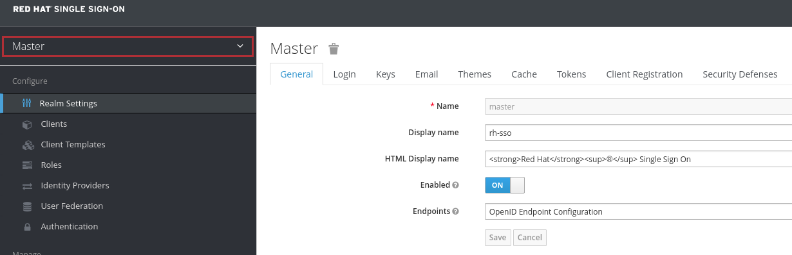
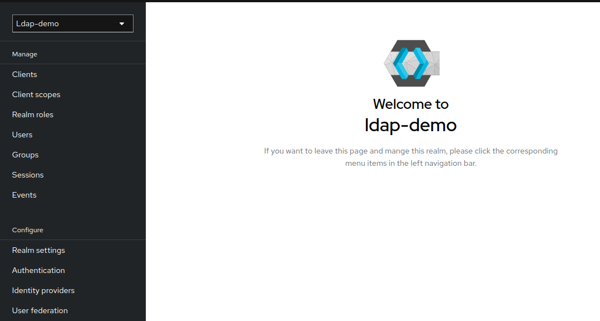
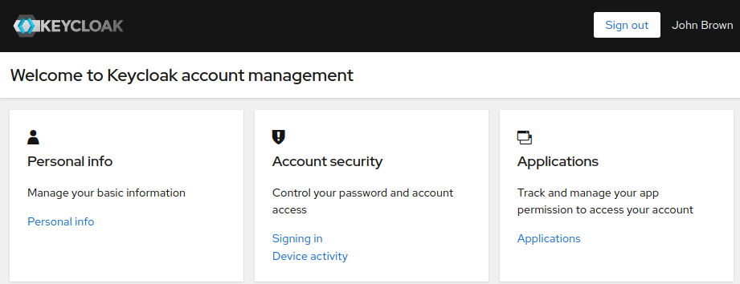
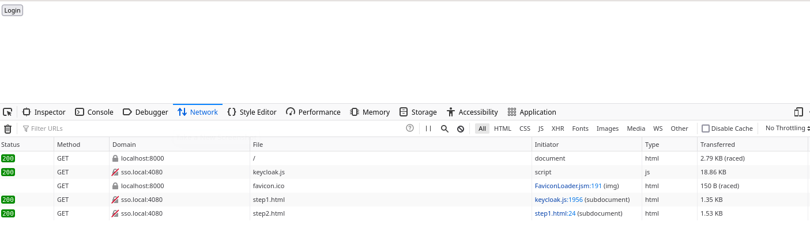

:scrollbar:
:data-uri:
:toc2:
:linkattrs:

= Setup 

:numbered:

== Components

This quickstart includes both _docker-compose_ (for a local deployment) as well as ansible (for deployment to OpenShift).
In both cases, the following containers are deployed (as per the above diagram) : 

.. *openldap*
+
System of record of user and role data.

.. *RH-SSO*
+
Provisioned with a realm enabled with _User Federation_ to openldap.

.. *Frontend* service
+
Quarkus based app that exposes REST API and invokes _backend_ service (with _Authorization_ header propogated to _backend_ service).

.. *Backend* service
+
Quarkus based app that exposes REST API secured using RBAC.
The service is enabled with a _keycloak adapter_.
At start-up, this _keycloak adapter_ acquires the SSO public key.
When a request is sent to this service, the _access token_ in the request is validated using this SSO public key. 

.. *Token Inspector* web app

== Deployment Environments
The exercises in this quickstart can be run locally (via `docker-compose`) or in OpenShift.
The following sections provide details for each environment.

It's typical to execute the exercises from just one of the two options.

=== docker-compose
This quickstart includes a _docker-compose_ to facilitate development and testing in your local environment.

==== Pre-reqs

. *docker* or *podman*

. *docker-compose*

. *curl*

. *ldapsearch*

. *jq*

==== Startup

. Start all linux containers for this quickstart:
+
-----
$ docker-compose -f etc/docker-compose.yaml up -d
-----

. The following containers should start:
+
-----
$ podman ps --format "{{.Image}}\t{{.Ports}}\t{{.Names}}"

registry.redhat.io/rhel8/postgresql-12:1-72.1626836556  0.0.0.0:4432->4432/tcp                          psql_sso
docker.io/osixia/openldap:1.5.0                         0.0.0.0:3389->389/tcp, 0.0.0.0:6636->636/tcp    openldap
quay.io/jbride/keycloak:17.0.0-2-psql                   0.0.0.0:4080->4080/tcp, 0.0.0.0:4443->4443/tcp  sso
quay.io/redhat_naps_da/backend-oidc:0.0.2               0.0.0.0:6080->6080/tcp                          backend-service
quay.io/redhat_naps_da/frontend-oidc:0.0.4              0.0.0.0:7080->7080/tcp                          frontend-service
quay.io/jbride/keycloak-token-inspector:0.0.1           0.0.0.0:8000->8000/tcp                          token-inspector
-----

==== Environment Variables

. Set the following environment variables with values similar to the following:
+
-----
export RHSSO_HOST=sso.local
export RHSSO_URL=http://$RHSSO_HOST:4080
export RHSSO_MASTER_PASSWD=admin
export REALM_ID=kc-demo
export REALM_ADMIN=ssoRealmAdmin
export REALM_ADMIN_PASSWD=admin
export SSO_CLIENT_ID=t-inspect
export ACCESS_TOKEN_URL="$RHSSO_URL/realms/$REALM_ID/protocol/openid-connect/token"
export BACKEND_ROUTE=http://localhost:6080
export FRONTEND_ROUTE=http://localhost:7080
-----

. Add the following entry to your `/etc/hosts`:
+
-----
127.0.0.1   sso.local
-----

==== keycloak admin utility

-----
$ podman exec -it sso /opt/keycloak/bin/kcadm.sh config credentials \
    --server http://127.0.0.1:4080 \
    --realm $REALM_ID \
    --user $REALM_ADMIN \
    --password $REALM_ADMIN_PASSWD
-----

. Also notice that a new corresponding _service account_ user is also created: 
+
-----
$ podman exec -it sso /opt/keycloak/bin/kcadm.sh get users -q username=service-account-$ZYNC_SSO_CLIENT_NAME

[ {
  "id" : "cc5f961a-4006-41cc-9b4f-c1e8740502ea",
  "createdTimestamp" : 1664385801502,
  "username" : "service-account-zyncsso",
  "enabled" : true,
  "totp" : false,
  "emailVerified" : false,
  "disableableCredentialTypes" : [ ],
  "requiredActions" : [ ],
  "notBefore" : 0,
  "access" : {
    "manageGroupMembership" : true,
    "view" : true,
    "mapRoles" : true,
    "impersonate" : true,
    "manage" : true
  }
} ]
-----

=== OpenShift
This quickstart includes _ansible_ to deploy to an OpenShift environment.  All of the same tests conducted in your local environment can be executed in your OpenShift environment.

==== Pre-reqs:
. _OpenShift_ cluster ( >= v 4.6 )
+
The cluster should have about 4 GBs and 2 CPUs to allocate to the resources of this quickstart.

. link:https://mirror.openshift.com/pub/openshift-v4/clients/ocp/?C=M;O=D[oc utility] corresponding to the version of your OpenShift cluster.

. _ansible-playbook_ utility installed

==== Startup

. Change directory into the _ansible_ directory of this project: 
+
-----
$ cd ansible
-----

. Ensure the `kubernetes.core` ansible galaxy collection is installed locally:
+
-----
$ ansible-galaxy collection install kubernetes.core
-----

. Execute _ansible_playbook_
+
-----
$ ansible-playbook playbooks/install.yml
-----

. The playbook provisions the following in OpenShift:

.. *rhi_idm* namespace:
... *openldap*
... *RH-SSO*

.. *user1-services* namespace: 
... *frontend* service
... *backend* service
... *token-inspector* web app

==== Environment Variables

. Set the following environment variables with values similar to the following:
+
-----
export OCP_DOMAIN=apps$(oc whoami --show-console | awk 'BEGIN{FS="apps"}{print $2}')
export RHSSO_HOST=sso-rhi-idm.$OCP_DOMAIN
export RHSSO_URL=https://$RHSSO_HOST/auth
export RHSSO_MASTER_PASSWD=$(oc get secret credential-rhsso -o json -n rhi-idm | jq -r .data.ADMIN_PASSWORD | base64 -d)
export REALM_ID=user1-ldap
export SSO_CLIENT_ID=t-inspect      # preset in realm deployed by project ansible
export ACCESS_TOKEN_URL="$RHSSO_URL/realms/$REALM_ID/protocol/openid-connect/token"
export FRONTEND_ROUTE=https://frontend-user1-services.$OCP_DOMAIN
-----

== RH-SSO Consoles and Endpoints

=== RH-SSO Site Admin
. Open a web browser and navigate to the RH-SSO console of the `master` realm :
+
-----
$ echo -en "\n$RHSSO_URL/admin/master/console\n\n"
-----

. Authenticate using `admin` as the userId and the value of the `$RHSSO_MASTER_PASSWD` environment variable as the password.
. As the RH-SSO site admin, you have full access to all of its resources.
+

=== RH-SSO Realm Admin

. Open a web browser and navigate to the console of your realm :
+
-----
$ echo -en "\n$RHSSO_URL/admin/$REALM_ID/console\n\n"
-----

. Authenticate using `ssoRealmAdmin` as the userId and `admin` as the password.
. As the RH-SSO realm admin, you have full access to all resources pertaining to your realm.
+

. Invoke _Discovery Endpoint_ of RH-SSO to view details of OIDC related REST APIs specific to your realm:
+
-----
$ curl -v -X GET "$RHSSO_URL/realms/$REALM_ID/.well-known/openid-configuration" | jq .
-----

=== RH-SSO Account Console

. Open a web browser and navigate to the console of your realm :
+
-----
$ echo -en "\n$RHSSO_URL/realms/$REALM_ID/console\n\n"
-----

. Authenticate using `jbrown` as the userId and `password` as the password.
+

== Token Inspector webapp
This lab includes a simple javascript based web app to display the OAuth2 _access_ and _refresh_ tokens.
It also allows for display of the OIDC _Id_ token.

The reason the _Token Inspector Webapp_ can display the _access_ and _refresh_ tokens is becauase it is a Javascript based _Single-Page App_ (SPA) with no intermediary REST API that supports it.  That means that this app is a _public_ SSO client that interacts directly with the SSO _authorization server_ and as such retrieves the _access_ and _refresh_ tokens as per the _Authorization Code_ flow.

This architecture, although easy to implement, is not particularly secure.
For more secure architectures involving an SPA, please read the section entitled _Securing a SPA with an intermediary REST API_ in Chapter 6 of the link:https://smile.amazon.com/Keycloak-Management-Applications-protocols-applications/dp/1800562497[Keycloak - Identity & Access Management for Modern Apps] book.

This web app was plagarized from the lab assets provided by the link:https://smile.amazon.com/Keycloak-Management-Applications-protocols-applications/dp/1800562497[Keycloak - Identity & Access Management for Modern Apps] book.
Subsequently, all credit for the _token inspector_ web app goes to the author of that book.  Thank you!

. Open a private web browser and navigate to:  http://localhost:8000
. Switch to the _Network_ tab of your _Web Developer Tools_ on that page.
+

. Click the `Login` button at the top-left corner of the page
. Notice the re-direction to the URL of the app's _SSO Realm_.  What are the request parameters?
. in the RH-SSO login form, authenticate using the following credentials:
.. *UserId* :  jbrown
.. *Password* :  password
. Notice the re-direction back to the _Token Inspector_ web app.
+
In the request to the _/token_ endpoint, what are the request parameters and what is included in the response ?

*Next Lab*:  Proceed to the link:README_oidc_tokens.adoc[RH-SSO Token Propogation and Customization Lab]

== Appendix

=== Optional:  Inspect JSON Web Tokens

. View keys of a response from RH-SSO when its `/token` endpoint is invoked:
+
-----
$ curl -X POST "$ACCESS_TOKEN_URL" \
    -H "Content-Type: application/x-www-form-urlencoded" \
    -d "username=jbrown" \
    -d "password=password" \
    -d "grant_type=password" \
    -d "client_id=$SSO_CLIENT_ID" \
    -d "scope=openid" \
    | jq -r 'keys[]'

access_token
expires_in
id_token
not-before-policy
refresh_expires_in
refresh_token
scope
session_state
token_type
-----
+
NOTE: The token format is of type link:https://datatracker.ietf.org/doc/html/rfc7515[JSON Web Signature]

. View the header of an access token:

.. Retrieve an OAuth2 access token using OAuth2 Resource Owner Password Credentials flow :
+
-----
TKN=$(curl -X POST "$ACCESS_TOKEN_URL" \
            -H "Content-Type: application/x-www-form-urlencoded" \
            -d "username=jbrown" \
            -d "password=password" \
            -d "grant_type=password" \
            -d "client_id=$SSO_CLIENT_ID" \
            -d "scope=openid" \
            | sed 's/.*access_token":"//g' | sed 's/".*//g')
-----

.. View the JWT header:
+
-----
$ jq -R 'split(".") | .[0] | @base64d | fromjson' <<< $TKN | jq .

{
  "alg": "RS256",
  "typ": "JWT",
  "kid": "mcjna6MSzQQVz6sjI_gOQYj0ByrbDLT7DthD4TnMy2U"
}

-----

.. Notice a `typ` of:   _JWT_ .
.. Because the access token is a JSON Web Token, its header, payload and signature can be viewed in:  https://jwt.io/

. Invoke the _/userinfo_ endpoint:
+
-----
$ curl -X GET "$RHSSO_URL/realms/$REALM_ID/protocol/openid-connect/userinfo" \
    -H "Content-Type: application/x-www-form-urlencoded" \
    -H "Authorization: Bearer $TKN" \
    | jq -r .

-----

. Invoke the _/token/introspect_ endpoint:
+
If a resource server needs to verify that an access token is active or wants more metadata about it, especially for link:https://auth0.com/docs/secure/tokens/access-tokens#opaque-access-tokens[opaque access tokens], then the token introspect endpoint is the answer. In this case, the resource server integrates the introspect process with the security configuration.
+
-----
$ curl -X POST "$RHSSO_URL/realms/$REALM_ID/protocol/openid-connect/token/introspect" \
    -H "Content-Type: application/x-www-form-urlencoded" \
    -d "client_id=bservice" \
    -d "client_secret=password" \
    -d "token=$TKN" \
    | jq -r .
-----
